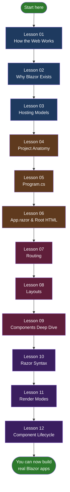

# Learn Blazor — From Zero to Confident

A hands-on, diagram-driven Blazor tutorial for **new C# developers** who have never touched web development before.

This repo teaches Blazor the way a good teacher explains a new subject: slowly, with pictures, with a real working project you can run, and with every file explained.

---

## Who This Is For

- You know a little C# (or are learning it)
- You've never built a web app before
- You want to understand **how** and **why**, not just copy-paste code
- You learn best from **diagrams, examples, and workflows**

If that's you, start at Lesson 01 and work through in order. Each lesson builds on the previous one.

---

## How This Repo Is Organized

```
blazor-tutorial/
├── README.md                   ← You are here
├── LearnBlazor/                ← The actual working Blazor app
│   ├── Program.cs
│   ├── Components/
│   │   ├── App.razor
│   │   ├── Routes.razor
│   │   ├── Layout/
│   │   └── Pages/
│   └── wwwroot/
└── docs/                       ← The lessons
    ├── 01-how-the-web-works.md
    ├── 02-why-blazor-exists.md
    ├── 03-hosting-models.md
    ├── 04-project-anatomy.md
    ├── 05-program-cs.md
    ├── 06-app-razor-and-root-html.md
    ├── 07-routing.md
    ├── 08-layouts.md
    ├── 09-components.md
    ├── 10-razor-syntax.md
    ├── 11-render-modes.md
    └── 12-component-lifecycle.md
```

---

## The Learning Path



**Color key:**
- Blue = Foundations (no code yet)
- Brown = Project structure
- Red = Building blocks
- Purple = Advanced mechanics

---

## Lessons Index

| # | Lesson | What you'll learn |
|---|--------|-------------------|
| [01](docs/01-how-the-web-works.md) | **How the Web Works** | Browsers, HTTP, HTML/CSS/JS, request-response cycle |
| [02](docs/02-why-blazor-exists.md) | **Why Blazor Exists** | The problem Blazor solves for C# devs |
| [03](docs/03-hosting-models.md) | **Hosting Models** | Blazor Server vs WebAssembly vs Hybrid |
| [04](docs/04-project-anatomy.md) | **Project Anatomy** | Every file in a Blazor project, explained |
| [05](docs/05-program-cs.md) | **Program.cs** | The startup pipeline, line by line |
| [06](docs/06-app-razor-and-root-html.md) | **App.razor** | How a browser request becomes rendered HTML |
| [07](docs/07-routing.md) | **Routing** | URL matching, `@page`, `NavLink`, navigation |
| [08](docs/08-layouts.md) | **Layouts** | `MainLayout`, `@Body`, nav menus, shared chrome |
| [09](docs/09-components.md) | **Components Deep Dive** | What they really are under the hood |
| [10](docs/10-razor-syntax.md) | **Razor Syntax** | Every `@`-directive you need to know |
| [11](docs/11-render-modes.md) | **Render Modes** | Static, Server, WebAssembly, Auto — when to use which |
| [12](docs/12-component-lifecycle.md) | **Component Lifecycle** | When methods fire, state changes, re-renders |

---

## Running the Sample App

The `LearnBlazor/` folder contains a standard `dotnet new blazor` project that the lessons walk through in detail.

### Prerequisites

- [.NET 9 SDK](https://dotnet.microsoft.com/download) or later

### Run it

```bash
cd LearnBlazor
dotnet run
```

Open your browser to the URL it prints (usually `http://localhost:5xxx`). You'll see the default Blazor template with three pages: Home, Counter, Weather.

---

## How to Use This Repo

1. **Read each lesson top to bottom.** They're short and build on each other.
2. **Look at the diagrams.** They're not decoration — they're the mental model.
3. **Open the referenced files** in `LearnBlazor/` as you read. Every lesson points at real code.
4. **Do the "Try This" exercises** at the end of each lesson. They're how the knowledge sticks.

---

## Questions / Feedback

This is a personal learning repo. Issues and PRs welcome.

---

*Built slowly and carefully, because skipping foundations is how people end up confused three weeks later.*
