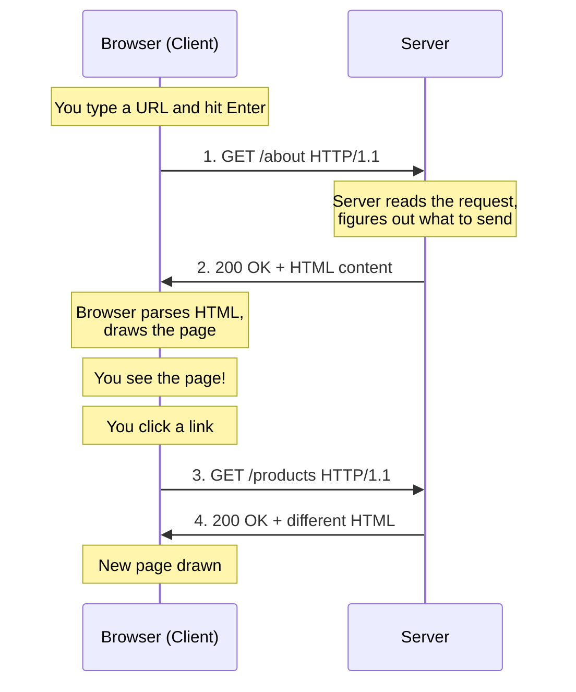
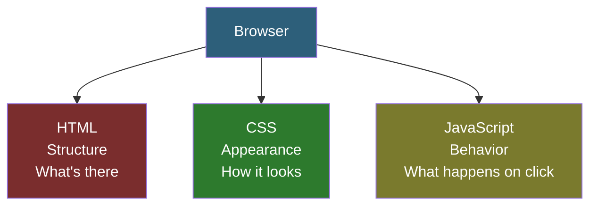
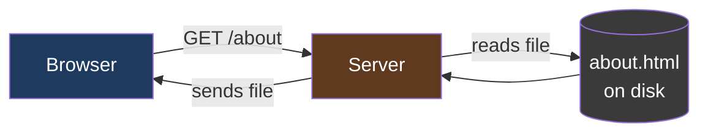
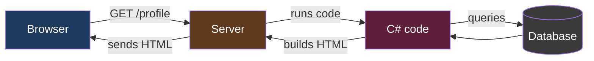
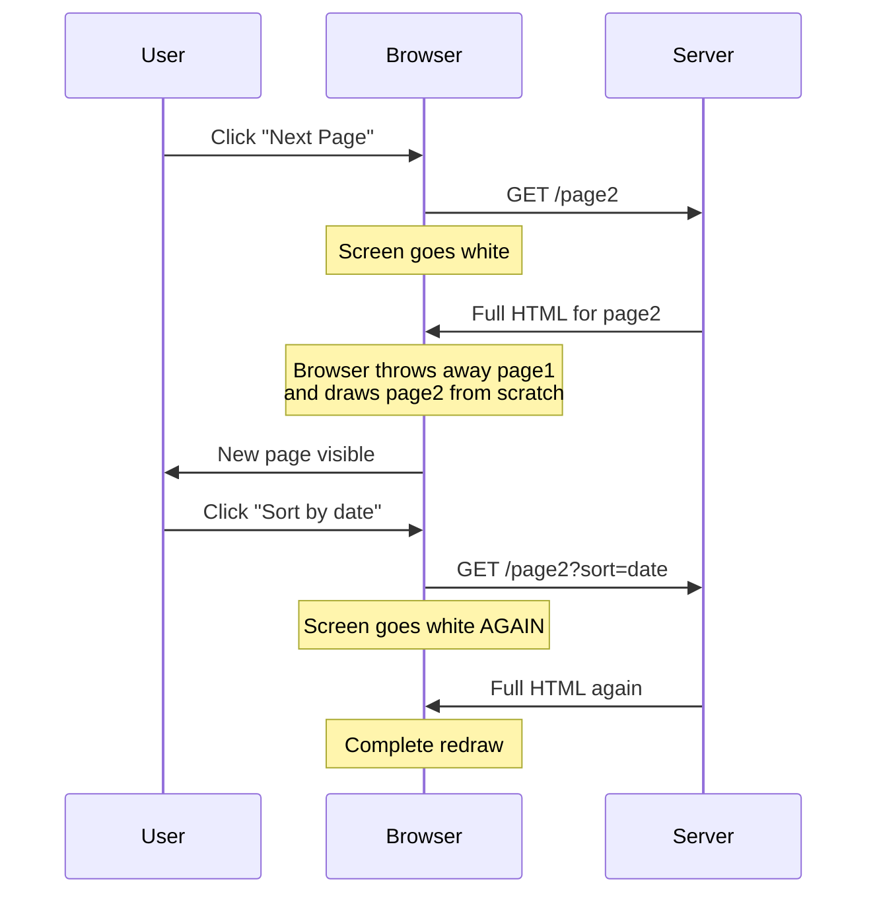
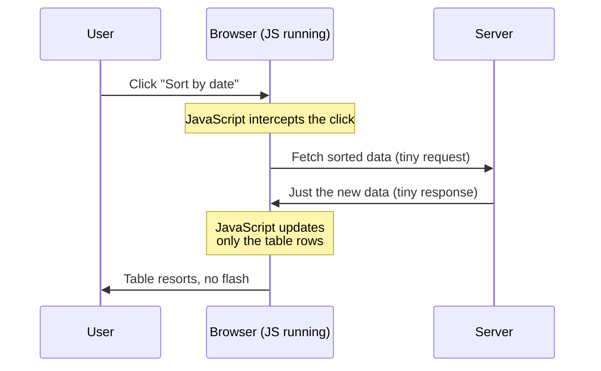

# Lesson 01 — How the Web Works

> **Why this lesson?** You can't understand Blazor until you understand what a "web app" actually is. This lesson has no Blazor in it. It's the foundation the rest of the tutorial stands on.

---

## The One-Sentence Summary

**A web app is two computers talking to each other using text messages, with one of them drawing pictures based on the text it receives.**

That's it. Everything else is detail.

---

## The Two Computers

Every web interaction involves two computers:

| Computer | Common name | Who runs it | What it does |
|----------|-------------|-------------|--------------|
| Yours | **Client** / Browser | You | Displays pages, sends clicks to the server |
| Someone else's | **Server** | A company | Sends back HTML and data |


When you type `google.com` into your browser, your computer (the client) sends a text message to Google's computer (the server). Google's computer sends back another text message containing the web page. Your browser reads that message and draws Google's homepage on your screen.

---

## The Text Messages: HTTP

The "text messages" the two computers send have a name: **HTTP** (HyperText Transfer Protocol).

An HTTP message has two parts:
1. **Headers** — metadata (who are you, what do you want, what format, etc.)
2. **Body** — the actual content

### Example: What your browser sends

When you click a link to `https://example.com/about`, your browser sends something like this:

```http
GET /about HTTP/1.1
Host: example.com
User-Agent: Mozilla/5.0 (Chrome)
Accept: text/html
```

Plain text. Nothing magic. It says: "Hey example.com, give me the `/about` page, I'm Chrome, and I understand HTML."

### Example: What the server sends back

```http
HTTP/1.1 200 OK
Content-Type: text/html
Content-Length: 1234

<!DOCTYPE html>
<html>
<head><title>About Us</title></head>
<body><h1>Hello</h1></body>
</html>
```

Also plain text. It says: "Everything's fine (200 OK), here's some HTML, it's 1234 characters long, enjoy."

---

## The Request-Response Cycle

This back-and-forth has a name: the **request-response cycle**.



Every single thing you do on a website — click a link, submit a form, load an image — is one of these cycles.

---

## What the Browser Actually Does

When HTML arrives, the browser reads it and follows the instructions to draw the page. The HTML is a set of instructions like:

```html
<h1>Welcome</h1>              <!-- Big heading -->
<p>This is a paragraph.</p>   <!-- Normal text -->
<button>Click me</button>     <!-- A button -->
         <!-- An image -->
```

Each of those tags tells the browser "draw this kind of thing on the screen."

### The Three Languages the Browser Understands

| Language | What it controls | Example |
|----------|------------------|---------|
| **HTML** | Structure — what's on the page | `<h1>Title</h1>` |
| **CSS** | Appearance — how it looks | `h1 { color: blue; }` |
| **JavaScript** | Behavior — what happens when you interact | `button.onclick = () => alert('hi')` |



> **Hard rule:** Browsers only understand these three languages natively. You cannot run C# directly in a browser. This is the problem Blazor solves (we'll get there in Lesson 02).

---

## Static Pages vs. Dynamic Pages

### Static page
The server has a file on disk called `about.html`. When a request comes in for `/about`, the server just hands that file back. Fast, simple, but the content never changes unless a human edits the file.



### Dynamic page
The server **generates** HTML on the fly by running code. Every request can produce different HTML based on who you are, what's in the database, or what time it is.



**Blazor builds dynamic pages.** The server runs your C# code to generate HTML per-request.

---

## The Problem: Everything Is a Round Trip

Traditional websites had a painful limitation: **every interaction was a full page reload**. Click a link? Full round trip, full page redraw. Submit a form? Same thing. The page would flash white while the next one loaded.



This was fine in 1998. By 2005 people wanted websites to feel like desktop apps — smooth, instant, no flashing.

### The Solution: JavaScript + AJAX

Around 2005, web developers started using **JavaScript** to fetch small pieces of data from the server *without* reloading the whole page. This technique was called **AJAX** (Asynchronous JavaScript and XML).



This is what made modern web apps possible. Gmail, Google Maps, Facebook — all built on JavaScript intercepting clicks and updating the page without full reloads.

### The Modern Frontend Framework Era

Eventually people built full **frameworks** on top of JavaScript to make this easier: React, Vue, Angular. These frameworks let you describe your UI as **components**, and the framework handles all the DOM updates for you.

**But they're all JavaScript.** Which means if you're a C# developer, you've either:
- Written two apps in two languages (C# backend + JS frontend), or
- Given up and learned JavaScript

This is exactly what Blazor changes. Which is the topic of Lesson 02.

---

## Key Terms to Remember

| Term | Meaning |
|------|---------|
| **Client** | Your browser (or any program making requests) |
| **Server** | The remote computer responding to requests |
| **HTTP** | The text-based protocol clients and servers use to talk |
| **Request** | A message from client to server ("give me X") |
| **Response** | The server's reply (usually HTML or data) |
| **HTML** | Structure of the page |
| **CSS** | Styling (colors, fonts, layout) |
| **JavaScript** | Behavior (what happens on interaction) |
| **Static page** | Server returns a pre-written file |
| **Dynamic page** | Server runs code to build the response |
| **Round trip** | One full request + response cycle |
| **AJAX** | Fetching data without reloading the whole page |

---

## Try This (No Code Required)

Open Chrome or Edge. Press `F12` to open **DevTools**. Click the **Network** tab. Now visit any website.

You'll see every single HTTP request the browser makes: the HTML file, then all the CSS files, then all the images, then any AJAX data requests. Click on one and look at the **Headers** tab — you're seeing the real HTTP messages we talked about.

**This is what Blazor is manipulating.** When you get to the later lessons and we talk about "the server sending render diffs over SignalR," open this panel again. You'll literally see the messages flowing by.

---

## Ready for Lesson 02?

Now that you understand what a web app *is*, you're ready to understand what problem Blazor solves.

➡️ **Next: [Lesson 02 — Why Blazor Exists](02-why-blazor-exists.md)**
