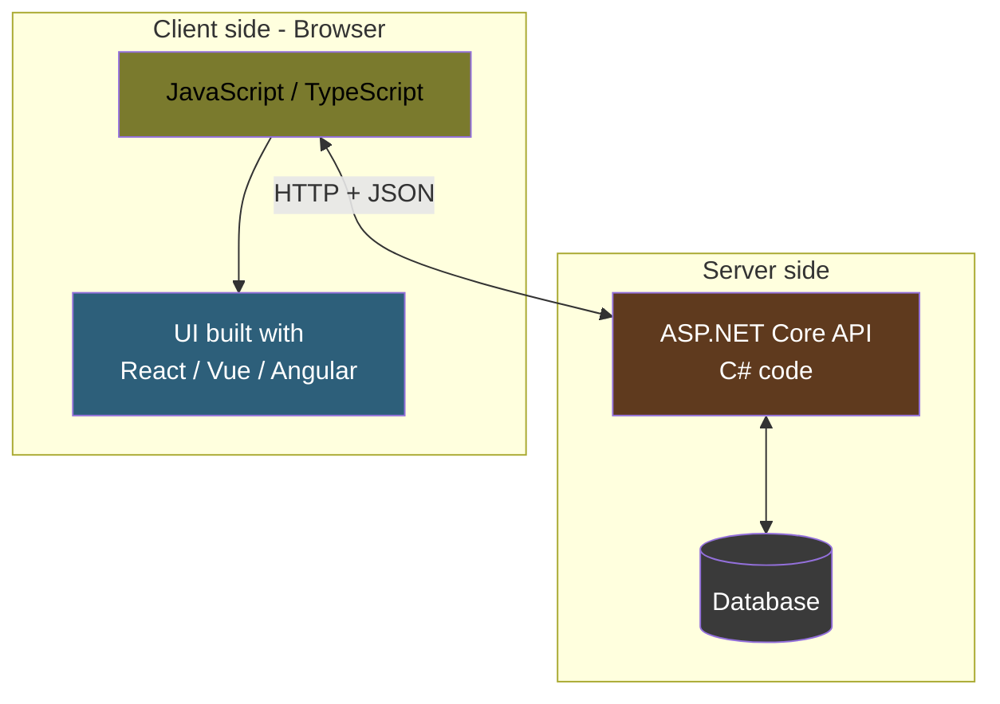
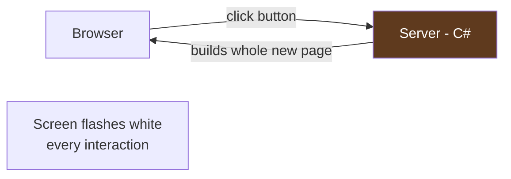
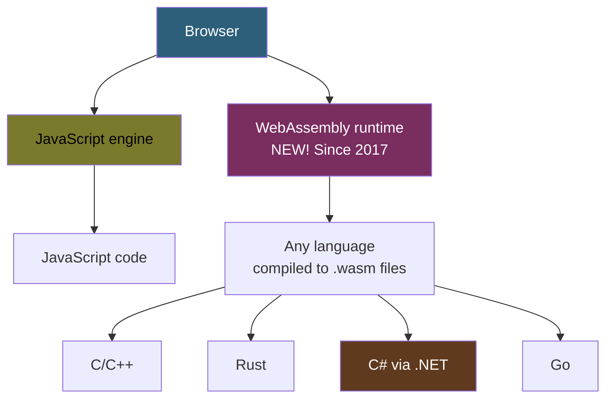
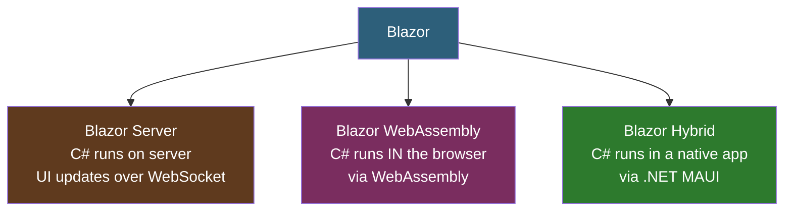
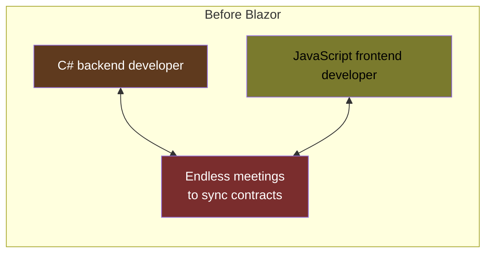
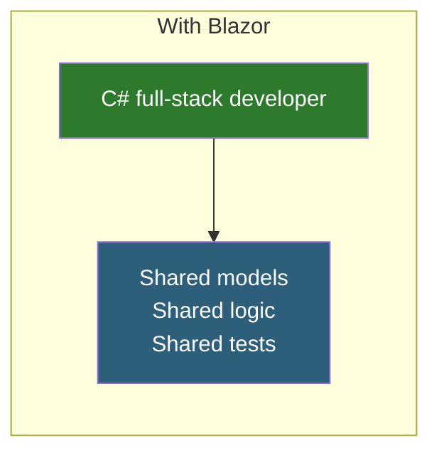

# Lesson 02 — Why Blazor Exists

> **Recap of Lesson 01:** A web app is a browser and a server exchanging HTTP messages. Browsers only natively understand HTML, CSS, and JavaScript.
>
> **This lesson:** The painful consequence of that rule for C# developers — and what Blazor does about it.

---

## The Problem, In One Picture

Imagine you're a C# developer building a web app the traditional way (pre-Blazor):

Notice what's happening. **Two codebases, two languages, two ecosystems:**

| Server side | Client side |
|-------------|-------------|
| C# / ASP.NET Core | JavaScript / TypeScript |
| NuGet packages | npm packages |
| Visual Studio / Rider | VS Code (usually) |
| `dotnet test` | `jest` / `vitest` |
| Entity Framework | fetch() / axios |
| Strong types everywhere | Types bolted on later (TypeScript) |

If you're a solo developer or a small team, **this is exhausting**. You have to be fluent in two entire worlds. A change that touches both sides means editing files in two repos, with two build systems, two package managers, two test frameworks, and two different mental models.

---

## What Other People Tried

Microsoft was not the first to notice this pain. Over the years, many people tried to make it go away. Understanding the history helps you understand why Blazor is designed the way it is.

### Attempt 1: Server-side rendering (old-school ASP.NET Web Forms, MVC)

Render all HTML on the server. Send a full page on every click.

**Worked for:** Simple sites, forms.
**Failed at:** Modern interactive UIs (no one wants screens that flash).

### Attempt 2: JavaScript frameworks (React / Vue / Angular)

Write the whole UI in JavaScript. C# is pushed to "just an API."

**Worked for:** Interactive UIs.
**Failed at:** C# developers who didn't want to learn JavaScript.

### Attempt 3: Transpilers (write C#, compile to JavaScript)

Tools like Bridge.NET and Script# tried to convert C# to JavaScript automatically.

**Worked for:** Small projects.
**Failed at:** Edge cases, debugging, framework integration, and keeping up with .NET language features.

### Attempt 4: Plugins (Silverlight, Flash, Java applets)

Install a plugin in the browser that runs C# (or another language). Microsoft's Silverlight used an actual .NET runtime.

**Worked for:** A few years.
**Failed at:** Mobile browsers never supported plugins. Apple killed Flash. Security concerns killed everything else. By 2015 all plugins were dead.

For a long time, it looked like **C# in the browser was just impossible**.

---

## The Breakthrough: WebAssembly

In 2015–2017, browser vendors shipped something revolutionary: **WebAssembly (WASM)**.

WebAssembly is a new thing browsers can execute besides JavaScript. It's a low-level, binary format that any language can compile to. It runs at near-native speed inside a sandbox.

> **Key point:** WebAssembly does NOT replace JavaScript. It runs alongside it. Every modern browser supports both.

This was the door that had been shut for 20 years. And Microsoft walked through it.

---

## Blazor's Proposition

In 2018, Microsoft announced **Blazor** — short for **Browser + Razor** (Razor is the templating syntax ASP.NET uses to mix C# and HTML).

Blazor's pitch:

> **Write your web UI in C# and Razor. We'll take care of getting your code to the browser. Your frontend and backend share the same language, the same types, the same tooling, and even the same classes.**

Blazor didn't actually stop at one solution — it shipped **two different ways** to run C# in the browser (and later a third for native apps). We'll explore them in depth in Lesson 03, but here's the preview:

All three use **the same component code**. You can literally take a `Counter.razor` file and run it in any of the three modes with zero changes.

---

## What Changes for You as a C# Developer

Before Blazor:

After Blazor:

Concrete examples of what that shared world looks like:

| Thing | In JavaScript world | In Blazor world |
|-------|---------------------|-----------------|
| Defining a `User` type | Once in C#, once in TypeScript, kept in sync manually | **Once in C#**, used everywhere |
| Validation rules | Duplicated in both languages | **Written once** in C# |
| Unit tests | Separate frameworks (xUnit + Jest) | **One test runner** for everything |
| Refactoring a field name | Change in two places, pray you found them all | **One rename**, the compiler finds all usages |
| Sharing a helper function | Copy-paste translated code | **Import** from a shared C# library |

---

## What Blazor Does NOT Change

Blazor is **not** magic. It does not:

- **Replace HTML/CSS.** You still write HTML and CSS. You just mix C# into the HTML instead of JavaScript.
- **Replace browsers.** Your app still runs in Chrome/Firefox/Safari/Edge.
- **Replace HTTP.** The client and server still talk via HTTP and WebSockets.
- **Make everything faster than JavaScript.** For some things it's faster, for others JavaScript is still the champion (especially tiny hot loops).
- **Eliminate JavaScript entirely.** You can call JavaScript from Blazor (and vice versa) for things that only have JS libraries. This is called **JS interop**.

What Blazor gives you is a **productivity and consistency win** for C# shops — not a performance revolution.

---

## When to Use Blazor (and When Not To)

### Great fits for Blazor

- Internal business applications (dashboards, admin panels)
- Line-of-business apps where the team is already a C# shop
- Apps that share lots of logic between client and server
- Teams that hate context-switching between languages
- Desktop-like web apps (long-lived sessions, rich interactions)
- Apps that need to also ship as native desktop/mobile (via Blazor Hybrid)

### Poor fits for Blazor

- **Public-facing marketing sites** — SEO/startup time matters more than interactivity
- **Very tiny apps** — loading a .NET runtime in the browser is overkill
- **Teams that are already deep in React/Vue** — switching costs outweigh benefits
- **Apps that need JS-only libraries** (some rich graphics/editors) — possible but friction-heavy

Don't worry about picking the right fit yet. For learning, Blazor Server is the fastest path to "I understand what's happening." We'll set it up in Lesson 04.

---

## The Single Insight to Take From This Lesson

> **Blazor is a way to write your browser-side code in C# instead of JavaScript.** It solves the "two languages, two ecosystems" problem for C# developers. It does this using one of three mechanisms — running C# on the server, running C# in WebAssembly, or running C# in a native app — which you'll learn about in the next lesson.

If you only remember one thing, remember that.

---

## Key Terms

| Term | Meaning |
|------|---------|
| **WebAssembly (WASM)** | A low-level format browsers can execute, alongside JavaScript. Lets languages other than JS run in the browser. |
| **Razor** | The templating syntax that mixes HTML and C#. File extension `.razor`. Comes from "Ra"zor "z"one — the `@` symbol was chosen because it cuts cleanly between HTML and C#. |
| **Blazor** | Browser + Razor. Microsoft's framework for building web UIs in C#. |
| **Full-stack** | One developer/team handling both client and server. Blazor makes this much easier for C# devs. |
| **JS Interop** | Blazor's escape hatch for calling JavaScript when you need a JS-only library. |

---

## Try This (Still No Code)

Before the next lesson, do this thought exercise:

1. Open a website you use daily (Gmail, GitHub, Amazon).
2. Open DevTools → Network tab (press F12).
3. Filter by "JS". Count how many JavaScript files it loaded.
4. Filter by "Fetch/XHR". Watch the tiny data requests flowing every time you click something.

That's what Blazor replaces (or interoperates with). A Blazor app does very similar things — but with C# on one or both sides of those arrows.

---

## Ready for Lesson 03?

Now you know **why** Blazor exists. Next, we'll dig into the three very different ways Blazor can deliver your C# code to the user. This is the single most important architectural decision you'll make in a Blazor project, and many tutorials skip it or hand-wave it. We won't.

➡️ **Next: [Lesson 03 — Hosting Models Explained](03-hosting-models.md)**
