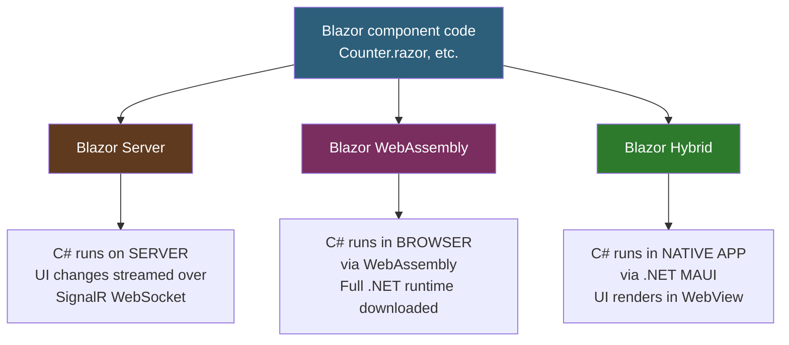
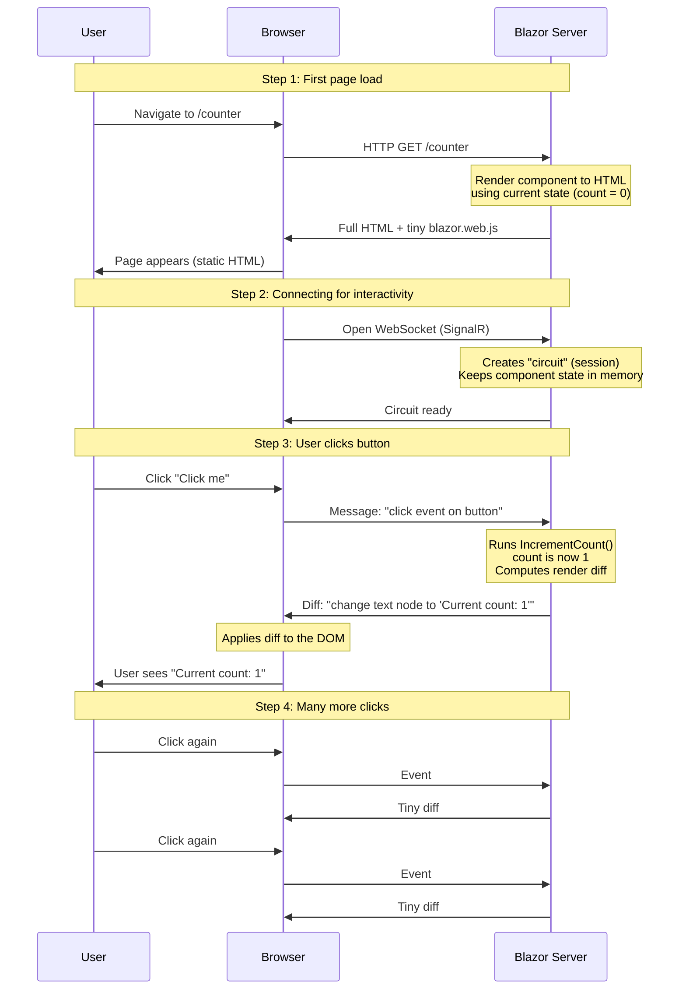
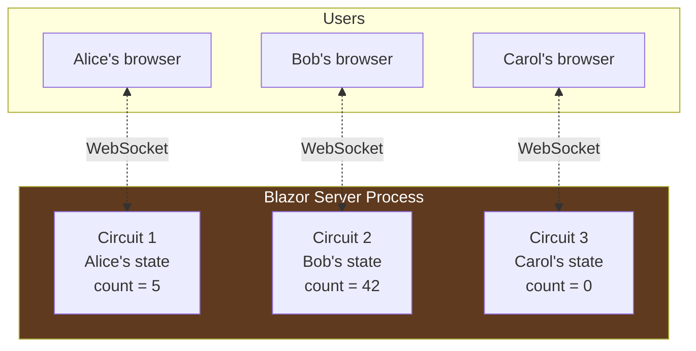
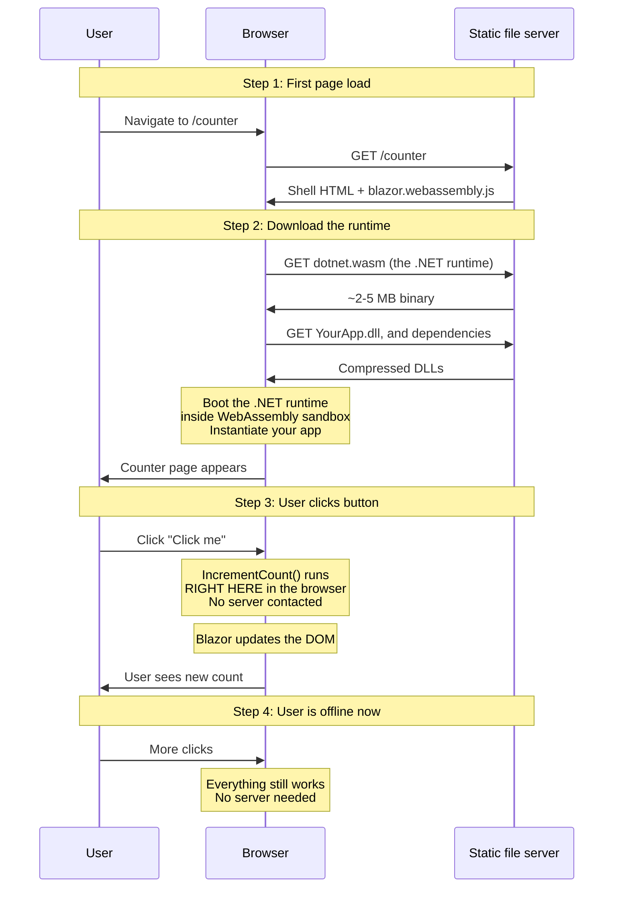
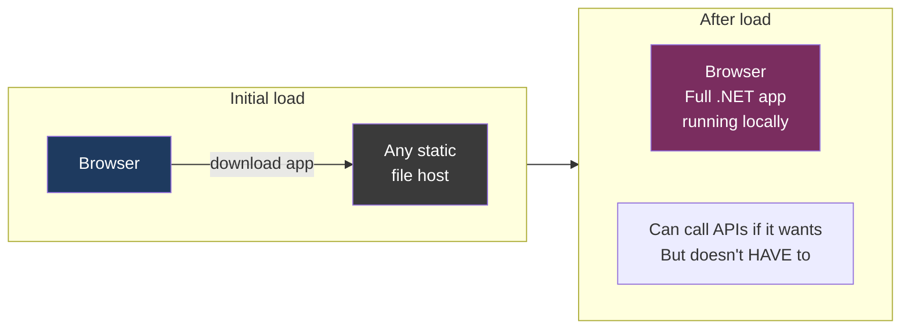
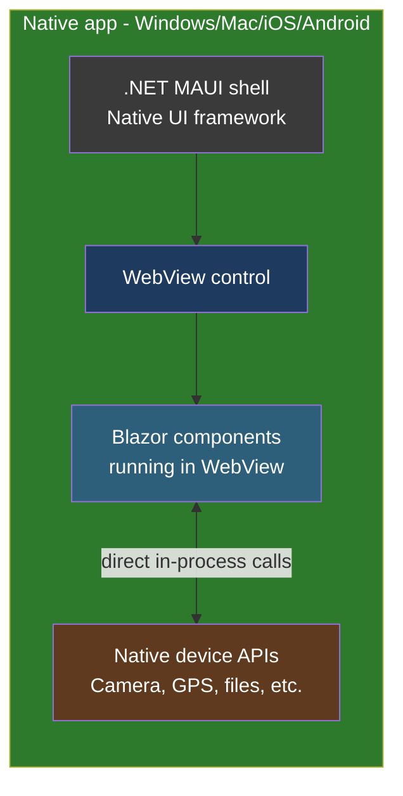
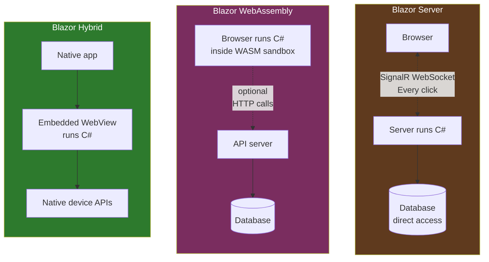

# Lesson 03 — Hosting Models Explained

> **Recap:** Blazor lets you write web UIs in C#. It ships three different ways of actually delivering that C# code to the user.
>
> **This lesson:** Understand each hosting model in depth — what runs where, when data crosses the network, what the user experiences, and when to pick each one.

---

## Why This Lesson Matters

Most Blazor tutorials skip this lesson or dismiss it in a paragraph. That's a mistake. The hosting model you choose changes:

- **Where your code runs** (security implications)
- **What the user experiences** (latency, offline support, startup time)
- **How your app scales** (cost per user, server load)
- **What you can do with the code** (database access, file system access, etc.)

Same component code, wildly different consequences.

---

## The Three Models at a Glance



The component you write (`Counter.razor`) is **identical** in all three cases. What changes is *where and how* that code actually runs.

---

## Model 1: Blazor Server (the one we'll use for learning)

### The Concept

Your C# code never leaves the server. The browser holds a **tiny stub** that maintains a persistent connection to the server. When you click a button, a message travels to the server, your C# runs there, and the server sends back **only the parts of the HTML that changed**.

### The Lifecycle, Step by Step



### The Key Thing: The "Circuit"

When a user opens your Blazor Server app, the server creates an object called a **circuit**. The circuit holds:

- The live component instances
- All their field values (`private int currentCount = 0`)
- The rendered HTML tree
- The WebSocket connection back to that specific user

As long as the circuit exists, the user's state is alive on the server. If the WebSocket drops (bad WiFi, laptop sleep), the browser tries to reconnect; if it can't, the user sees a "reconnect failed" message and the state is gone.



### Blazor Server Pros / Cons

| Pros | Cons |
|------|------|
| Small initial download | Requires constant connection |
| Fast startup | Every interaction is a network round-trip (latency) |
| C# code stays private on server | Server holds state for every user (memory cost) |
| Easy to debug (everything on the server) | Harder to scale to massive user counts |
| Full access to server-only APIs (DB, filesystem) | Won't work offline |
| No need to expose APIs for most things | Dropped connection = lost state |

### When to Use Blazor Server

- Internal business apps (stable network, trusted users)
- Apps that need direct database access with minimal API surface
- Anything where you want to start learning Blazor **today** with the simplest setup

**This is what we'll use for the rest of the tutorial.**

---

## Model 2: Blazor WebAssembly

### The Concept

The browser downloads a **mini .NET runtime** plus all of your DLLs, and then **your C# code runs directly inside the browser** via WebAssembly. The server becomes optional — once the app is loaded, the user can use it without any server at all.

### The Lifecycle, Step by Step



### Important Detail: Your Server Is Optional



A Blazor WASM app can be hosted on:
- Azure Static Web Apps
- GitHub Pages
- Netlify
- An S3 bucket
- Any nginx server
- Literally a USB drive (sort of)

Because there's no persistent server code, it's effectively just a static website from the hosting perspective.

### Blazor WebAssembly Pros / Cons

| Pros | Cons |
|------|------|
| Runs fully client-side | Large initial download (.NET runtime is several MB) |
| Can work offline (PWA) | Slower startup |
| No per-user server cost | Code is visible to users (no secrets!) |
| Scales infinitely (static hosting) | Can't directly access databases (must call APIs) |
| Instant interactions (no network round-trip) | All DLLs ship to the client |
| Feels like a desktop app | Older browsers may struggle |

### When to Use Blazor WebAssembly

- Apps that need to work offline
- Apps with many users where server cost matters
- Apps you want to host cheaply (static hosting)
- Apps where you're OK with a longer startup in exchange for instant interactivity

---

## Model 3: Blazor Hybrid

### The Concept

Your Blazor components render inside a **native desktop or mobile app** built with .NET MAUI. There's no web server involved at all. The "browser" is a `WebView` control embedded in your app.



### The Key Difference

Unlike Blazor Server or WebAssembly, **Blazor Hybrid is not a website**. It's a **native app** that happens to use HTML/Razor for its UI layer.

- No HTTP requests
- No WebSocket
- Components call into native code directly (no interop marshaling)
- Ships through the App Store / Microsoft Store like any other app

### When to Use Blazor Hybrid

- You're building a cross-platform native app
- You want to reuse Blazor components you already have
- You need access to native device features (camera, Bluetooth, etc.)
- You don't want to ship as a website at all

We won't cover Hybrid in depth in this tutorial — it deserves its own series — but you should know it exists.

---

## Side-by-Side Comparison



| Dimension | Server | WebAssembly | Hybrid |
|-----------|--------|-------------|--------|
| Where C# runs | Server | Browser | Native app |
| Initial download | Tiny (~100 KB) | Large (several MB) | App store install |
| Startup speed | Fast | Slower | Native-fast |
| Needs internet | Yes (constant) | Only for load | No |
| Per-click latency | Network round-trip | Zero | Zero |
| DB access | Direct | Via API | Direct (native) |
| Scalability | Server-bound | Infinite (static) | Per-device |
| Code secrecy | Safe (server) | Visible to users | Depends |
| Offline support | No | Yes (PWA) | Yes |

---

## And There's a Fourth Thing: Render Modes (preview)

Starting in .NET 8 (2023), Blazor introduced something new called **render modes**. Inside a single project you can mix and match:

- **Static SSR** (no interactivity — just server-rendered HTML, fast and SEO-friendly)
- **InteractiveServer** (the Blazor Server model we just discussed)
- **InteractiveWebAssembly** (the WASM model)
- **InteractiveAuto** (start on server, upgrade to WASM once it's downloaded)

This means a single app can have:
- A fast static landing page
- A server-rendered admin panel
- A WASM-rendered interactive chart
- All in the same project, all sharing components

We'll cover render modes in detail in **Lesson 11**. For now, just know that the line between "Server" and "WebAssembly" is no longer an either/or choice at the *project* level — it can be made per-component.

---

## The Choice for This Tutorial

For the rest of this course we will use **Blazor Server** with **InteractiveServer** render mode, because:

1. It's the fastest to set up and run
2. You can debug everything with one debugger
3. The concepts translate directly to the other models
4. The sample project `LearnBlazor/` is already configured this way

Once you're confident with Server, switching to WebAssembly or Hybrid is a matter of project template + render mode — not a rewrite.

---

## Key Terms

| Term | Meaning |
|------|---------|
| **Blazor Server** | Hosting model where C# runs on the server and UI diffs stream to the browser over WebSocket |
| **Blazor WebAssembly / WASM** | Hosting model where C# runs directly in the browser via WebAssembly |
| **Blazor Hybrid** | Hosting model where Blazor components run inside a native .NET MAUI app |
| **Circuit** | A live session between a browser and the server in Blazor Server. Holds component state. |
| **SignalR** | Microsoft's library for real-time communication. Blazor Server uses it for the browser-to-server WebSocket. |
| **Render mode** | Introduced in .NET 8 — a per-component setting that chooses Static, Server, WebAssembly, or Auto |
| **WebView** | A control embedded in native apps that can display HTML/CSS/JS. Used by Blazor Hybrid. |

---

## Try This (Still No Code)

Open `LearnBlazor/Program.cs` in the repo. Look at these two lines:

```csharp
builder.Services.AddRazorComponents()
    .AddInteractiveServerComponents();
```

and

```csharp
app.MapRazorComponents<App>()
    .AddInteractiveServerRenderMode();
```

These are what configure the project as a **Blazor Server** app. If we were building a WebAssembly project, these would say `AddInteractiveWebAssemblyComponents()` and `AddInteractiveWebAssemblyRenderMode()` instead. Different hosting models, same project structure.

Don't worry about understanding `Program.cs` in full yet — we break it down line by line in **Lesson 05**.

---

## Ready for Lesson 04?

Now that you know what Blazor is, why it exists, and what hosting options you have, it's time to actually look at **a real project on disk**. We'll open every file, explain what it does, and start building your mental map of a Blazor project.

➡️ **Next: [Lesson 04 — Project Anatomy](04-project-anatomy.md)**
