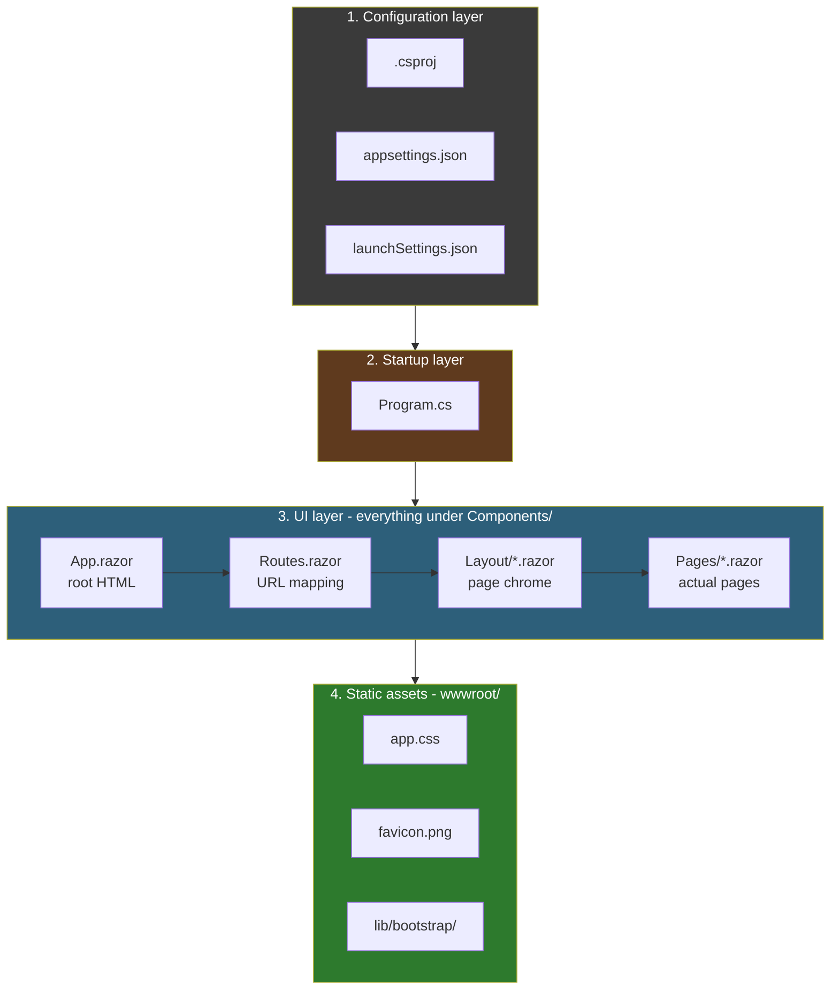
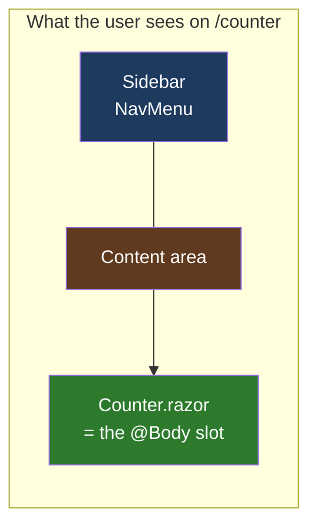
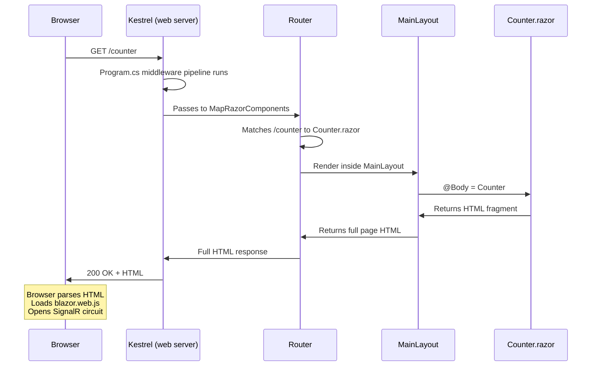

# Lesson 04 — Project Anatomy: Every File Explained

> **Recap:** Blazor lets you write C# that runs in (or to) the browser. Three hosting models: Server, WebAssembly, Hybrid. We're using Server.
>
> **This lesson:** Crack open a real Blazor project and explain every single file. By the end, you'll know what every folder is for and what every file does.

---

## How This Project Was Created

If you want to make your own, the command is:

```bash
dotnet new blazor --name LearnBlazor --framework net9.0 --interactivity Server
```

Decoded:
- `dotnet new blazor` — use the Blazor Web App template
- `--name LearnBlazor` — name the project (and folder) "LearnBlazor"
- `--framework net9.0` — target .NET 9
- `--interactivity Server` — set the default interactivity to Blazor Server (vs. WebAssembly or Auto)

The template generates about 20 code files. Here's what you get:

---

## The Folder Tree

```
LearnBlazor/
├── LearnBlazor.csproj         ← Project definition (the "recipe")
├── Program.cs                 ← Application startup (Lesson 05)
├── appsettings.json           ← Runtime configuration (prod)
├── appsettings.Development.json ← Runtime config (dev only)
├── Properties/
│   └── launchSettings.json    ← "How to run this locally" settings
├── Components/                ← All Blazor UI code lives here
│   ├── _Imports.razor         ← Shared "using" directives
│   ├── App.razor              ← Root HTML document (Lesson 06)
│   ├── Routes.razor           ← URL routing setup (Lesson 07)
│   ├── Layout/
│   │   ├── MainLayout.razor       ← Page chrome: sidebar + content area
│   │   ├── MainLayout.razor.css   ← Scoped CSS for the layout
│   │   ├── NavMenu.razor          ← Sidebar navigation
│   │   └── NavMenu.razor.css      ← Scoped CSS for the nav menu
│   └── Pages/
│       ├── Home.razor             ← / page
│       ├── Counter.razor          ← /counter page
│       ├── Weather.razor          ← /weather page
│       └── Error.razor            ← Shown on exceptions
└── wwwroot/                    ← Static files served as-is
    ├── app.css                     ← Global site CSS
    ├── favicon.png                 ← Tab icon
    └── lib/
        └── bootstrap/              ← Bootstrap CSS framework (vendored)
```

Looks like a lot. Most of it is repetitive. Let me group it for you.

---

## The Four Layers of a Blazor Project



Let's walk through each layer.

---

## Layer 1: Configuration

### `LearnBlazor.csproj`

The **project file** tells .NET how to build your code — which SDK to use, which framework version, which NuGet packages, etc.

```xml
<Project Sdk="Microsoft.NET.Sdk.Web">

  <PropertyGroup>
    <TargetFramework>net9.0</TargetFramework>
    <Nullable>enable</Nullable>
    <ImplicitUsings>enable</ImplicitUsings>
  </PropertyGroup>

</Project>
```

Line by line:

| Line | Meaning |
|------|---------|
| `Sdk="Microsoft.NET.Sdk.Web"` | This is a web project. Pulls in all the web-related build targets. |
| `TargetFramework` | Which .NET version to compile against. `net9.0` = .NET 9. |
| `Nullable>enable` | Turn on null-reference warnings (the `string?` vs `string` distinction). |
| `ImplicitUsings>enable` | Auto-include common `using` statements (like `System`, `System.Collections.Generic`). Saves boilerplate at the top of every file. |

> **Note:** This project has **zero NuGet packages declared**. Blazor itself is built into `Microsoft.NET.Sdk.Web`. That's rare — most real projects will have `<PackageReference>` entries here.

### `appsettings.json` / `appsettings.Development.json`

Runtime configuration in JSON. Things like connection strings, feature flags, logging levels. The `.Development.json` version overrides settings when running locally.

```json
{
  "Logging": {
    "LogLevel": {
      "Default": "Information",
      "Microsoft.AspNetCore": "Warning"
    }
  }
}
```

This isn't Blazor-specific — it's standard ASP.NET Core configuration. You access these values in code via `IConfiguration` (which we'll cover much later when we talk about dependency injection).

### `Properties/launchSettings.json`

Only used during **local development**. Tells Visual Studio / `dotnet run` things like:
- What port to listen on
- Whether to launch a browser automatically
- Environment variables to set

This file is **not deployed to production**. It's a development-only convenience.

---

## Layer 2: Startup

### `Program.cs`

The **entry point** of your application. This is where the web server is configured and launched. It's a small file but every line matters.

```csharp
using LearnBlazor.Components;

var builder = WebApplication.CreateBuilder(args);

builder.Services.AddRazorComponents()
    .AddInteractiveServerComponents();

var app = builder.Build();

if (!app.Environment.IsDevelopment())
{
    app.UseExceptionHandler("/Error", createScopeForErrors: true);
}

app.UseAntiforgery();

app.MapStaticAssets();
app.MapRazorComponents<App>()
    .AddInteractiveServerRenderMode();

app.Run();
```

Don't try to understand all of this yet. **Lesson 05** is dedicated to this single file. For now, know that:

- It builds a `WebApplication` object
- Registers Blazor's services with dependency injection
- Sets up middleware (anti-forgery, exception handler, static files)
- Maps Blazor components to HTTP requests
- Starts the web server

---

## Layer 3: The UI Layer (`Components/`)

This is where 95% of your work happens. Every file here ends in `.razor`.

### `Components/_Imports.razor`

Shared `@using` directives that apply to **every** `.razor` file in the folder (and subfolders).

```razor
@using System.Net.Http
@using System.Net.Http.Json
@using Microsoft.AspNetCore.Components.Forms
@using Microsoft.AspNetCore.Components.Routing
@using Microsoft.AspNetCore.Components.Web
@using static Microsoft.AspNetCore.Components.Web.RenderMode
@using Microsoft.AspNetCore.Components.Web.Virtualization
@using Microsoft.JSInterop
@using LearnBlazor
@using LearnBlazor.Components
```

Without this file, you'd have to write `@using Microsoft.AspNetCore.Components.Forms` at the top of every single page that uses forms. `_Imports.razor` saves you from that repetition.

The underscore prefix is a convention meaning "this file is infrastructure, not a component you'd render directly."

### `Components/App.razor` — The Root HTML Document

This is the **only `.razor` file that contains an entire HTML document**. Every other component will be an HTML fragment.

```razor
<!DOCTYPE html>
<html lang="en">

<head>
    <meta charset="utf-8" />
    <meta name="viewport" content="width=device-width, initial-scale=1.0" />
    <base href="/" />
    <link rel="stylesheet" href="@Assets["lib/bootstrap/dist/css/bootstrap.min.css"]" />
    <link rel="stylesheet" href="@Assets["app.css"]" />
    <link rel="stylesheet" href="@Assets["LearnBlazor.styles.css"]" />
    <ImportMap />
    <link rel="icon" type="image/png" href="favicon.png" />
    <HeadOutlet />
</head>

<body>
    <Routes />
    <script src="_framework/blazor.web.js"></script>
</body>

</html>
```

Highlights (deep dive in **Lesson 06**):

| Line | What it does |
|------|--------------|
| `<!DOCTYPE html>` | Standard HTML document declaration |
| `<base href="/" />` | Tells the browser what the "root" URL is. Critical for routing. |
| `<link rel="stylesheet" href="@Assets[...]">` | `@Assets` is Blazor's way of fingerprinting static files for cache busting |
| `<HeadOutlet />` | A slot for pages to inject things into `<head>` (like page titles) |
| `<Routes />` | This is where the actual routed page content will appear |
| `<script src="_framework/blazor.web.js">` | The tiny Blazor client script that opens the WebSocket to the server |

### `Components/Routes.razor` — URL-to-Component Mapping

```razor
<Router AppAssembly="typeof(Program).Assembly">
    <Found Context="routeData">
        <RouteView RouteData="routeData" DefaultLayout="typeof(Layout.MainLayout)" />
        <FocusOnNavigate RouteData="routeData" Selector="h1" />
    </Found>
</Router>
```

The `<Router>` component scans your assembly for components marked with `@page "/something"` and maps URLs to them. When a URL is matched, it renders the page inside `MainLayout`. Full walkthrough in **Lesson 07**.

### `Components/Layout/MainLayout.razor` — The Page Chrome

This is the "shell" that wraps every page — the sidebar, top bar, footer, etc.

```razor
@inherits LayoutComponentBase

<div class="page">
    <div class="sidebar">
        <NavMenu />
    </div>

    <main>
        <div class="top-row px-4">
            <a href="https://learn.microsoft.com/aspnet/core/" target="_blank">About</a>
        </div>

        <article class="content px-4">
            @Body
        </article>
    </main>
</div>
```

Two things to notice:

1. **`@inherits LayoutComponentBase`** — declares "this is a layout, not a regular component"
2. **`@Body`** — magical placeholder where the actual page content gets slotted in

Visualized:



Deep dive in **Lesson 08**.

### `Components/Layout/NavMenu.razor` — The Sidebar

```razor
<div class="top-row ps-3 navbar navbar-dark">
    <div class="container-fluid">
        <a class="navbar-brand" href="">LearnBlazor</a>
    </div>
</div>

<div class="nav-scrollable">
    <nav class="nav flex-column">
        <div class="nav-item px-3">
            <NavLink class="nav-link" href="" Match="NavLinkMatch.All">
                Home
            </NavLink>
        </div>
        <div class="nav-item px-3">
            <NavLink class="nav-link" href="counter">
                Counter
            </NavLink>
        </div>
        <div class="nav-item px-3">
            <NavLink class="nav-link" href="weather">
                Weather
            </NavLink>
        </div>
    </nav>
</div>
```

`NavLink` is Blazor's smart version of `<a>`. It automatically highlights itself when the current URL matches its `href`. We'll dig into this in **Lesson 07**.

### `Components/Pages/*.razor` — The Actual Pages

There are four of them in the template:

| File | Route | What it does |
|------|-------|--------------|
| `Home.razor` | `/` | Static welcome page |
| `Counter.razor` | `/counter` | Interactive counter (click to increment) |
| `Weather.razor` | `/weather` | Fake weather table with async loading |
| `Error.razor` | (none) | Shown when an exception happens |

We'll dissect `Counter.razor` in **Lesson 09** because it's the simplest interactive component — and it perfectly illustrates the magic of Blazor's render model.

### Scoped CSS: `*.razor.css`

Notice that `MainLayout.razor` has a sibling file called `MainLayout.razor.css`. This is **scoped CSS**. Any styles in that file will apply **only to** `MainLayout.razor`, not leak out to other components. Blazor does this by adding a unique attribute to each element and rewriting the selectors at build time.

```mermaid
flowchart LR
    Source[MainLayout.razor.css<br/>.page { ... }] --> Build[Build process]
    Build --> Output[Rewritten CSS<br/>.page[b-abc123] { ... }]
    Output --> Final[Only applies to<br/>MainLayout.razor elements]

    style Source fill:#3a3a3a,color:#fff
    style Build fill:#5f3a1e,color:#fff
    style Output fill:#2d5f7a,color:#fff
    style Final fill:#2d7a2d,color:#fff
```

You don't have to do anything special — name the file `XYZ.razor.css` next to `XYZ.razor` and it just works.

---

## Layer 4: Static Assets (`wwwroot/`)

Anything under `wwwroot/` gets served **as-is** at the root of your website. It doesn't get compiled or processed.

| File | Serves at | Purpose |
|------|-----------|---------|
| `wwwroot/app.css` | `/app.css` | Global site CSS (things that aren't scoped) |
| `wwwroot/favicon.png` | `/favicon.png` | Browser tab icon |
| `wwwroot/lib/bootstrap/...` | `/lib/bootstrap/...` | Bootstrap CSS framework, vendored into the project |

**Rule of thumb:** if it's a static file you want to ship to the browser unchanged, put it in `wwwroot/`.

---

## The Request → Response Flow in This Project

Let's trace what happens when a user navigates to `http://localhost:5000/counter`:



Don't worry if this looks complicated — the next few lessons will make every arrow concrete.

---

## Conventions to Internalize

These aren't rules Blazor enforces, but they're conventions every Blazor project follows:

| Convention | Why |
|------------|-----|
| Razor files go in `Components/` | Template default. Keeps UI code separate from configuration. |
| Pages go in `Components/Pages/` | Makes them easy to find. Has no functional meaning — the `@page` directive is what actually makes something a page. |
| Layouts go in `Components/Layout/` | Convention only. They're just components marked with `@inherits LayoutComponentBase`. |
| Files starting with `_` are infrastructure | `_Imports.razor` in particular |
| Scoped CSS sits next to its component | `Foo.razor` ⇢ `Foo.razor.css` |
| `wwwroot/` is the only place static assets live | Required — Blazor only serves files from here |

---

## Key Terms

| Term | Meaning |
|------|---------|
| **`.csproj`** | The project file — tells .NET how to build your code |
| **`Program.cs`** | The entry point — configures and starts the web server |
| **`wwwroot/`** | Folder for static files served as-is |
| **`Components/`** | Folder for all Razor (`.razor`) files |
| **`_Imports.razor`** | Shared `@using` directives for all components in the folder |
| **`App.razor`** | The one file that contains the full HTML document |
| **`Routes.razor`** | URL-to-component mapping |
| **Layout** | A component that wraps other pages (provides shared chrome) |
| **Page** | A component with a `@page "/..."` directive that's routable by URL |
| **Scoped CSS** | CSS in `Foo.razor.css` that only applies to `Foo.razor` |
| **`@Assets[...]`** | Blazor helper that fingerprints static file URLs for cache busting |
| **`<HeadOutlet />`** | A slot in `<head>` that pages can push `<title>` etc. into |

---

## Try This

1. Open `LearnBlazor/Components/Pages/Home.razor` and change "Hello, world!" to "Hello from my Blazor app!"
2. Run the app: `cd LearnBlazor && dotnet run`
3. Open the URL it prints. Navigate to Home and see your change.
4. Add a new file `Components/Pages/About.razor` with this content:

```razor
@page "/about"

<PageTitle>About</PageTitle>

<h1>About This Site</h1>
<p>I'm learning Blazor.</p>
```

5. Refresh the browser and manually navigate to `/about`. You should see your new page (note: it won't appear in the nav menu yet — we'll add it in Lesson 07).

> If you can do this, you've already built your first Blazor page.

---

## Ready for Lesson 05?

You've seen every file. Now let's zoom in on the single most important one: `Program.cs`. We'll go line by line and explain what each one does.

➡️ **Next: [Lesson 05 — Program.cs: The Startup Pipeline](05-program-cs.md)**
