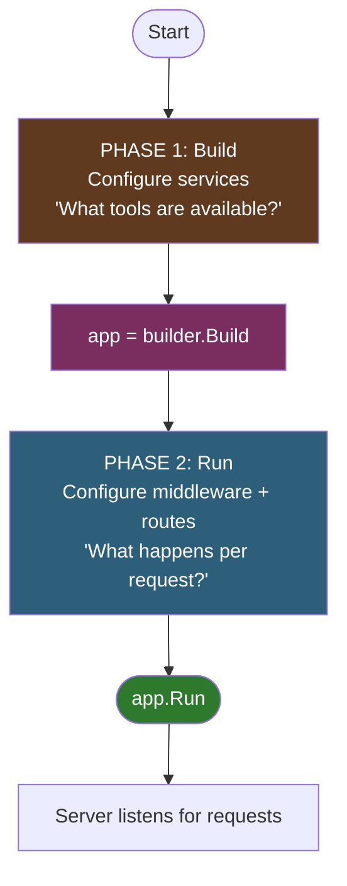
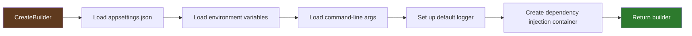
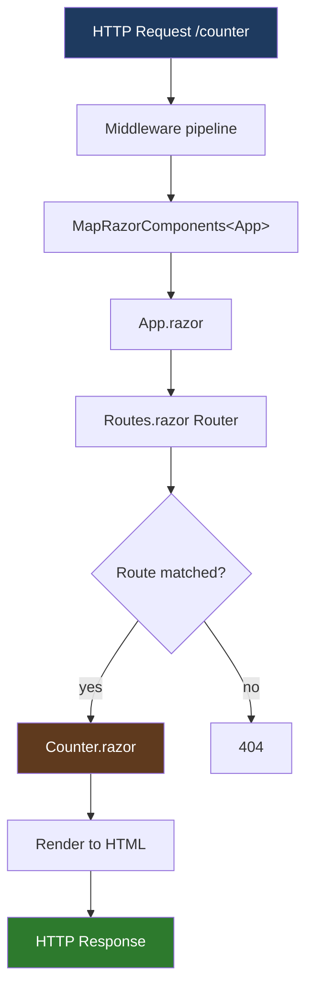
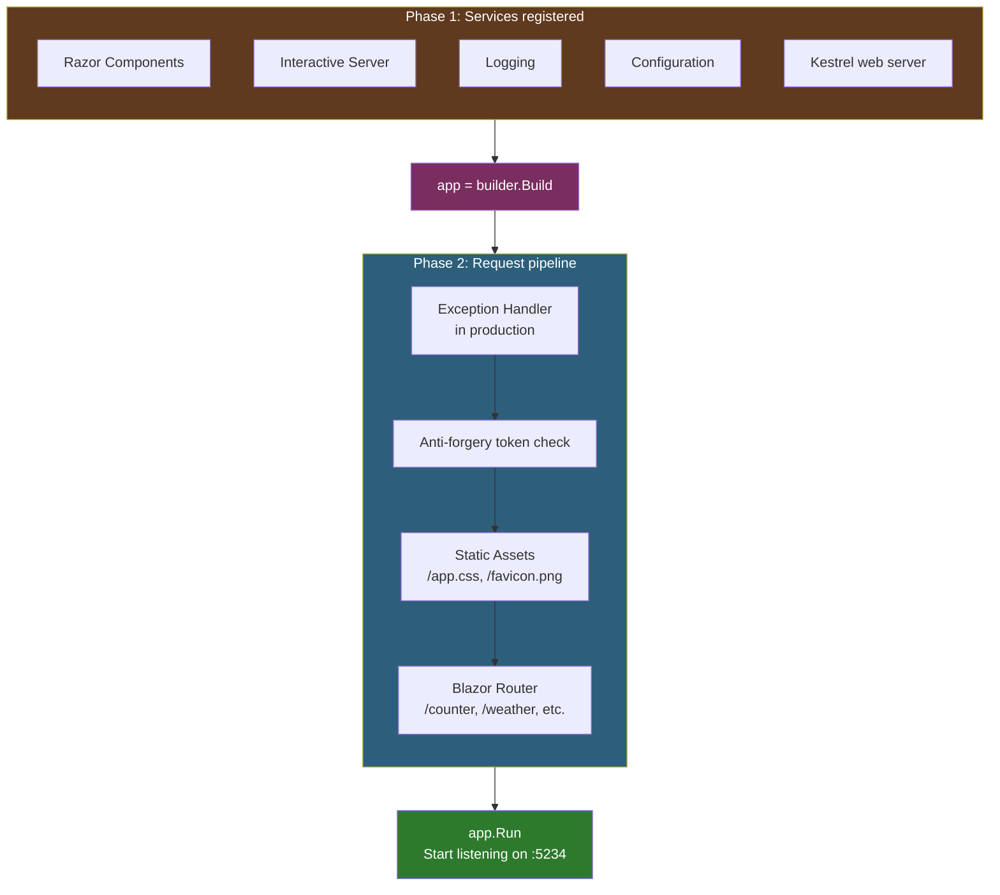
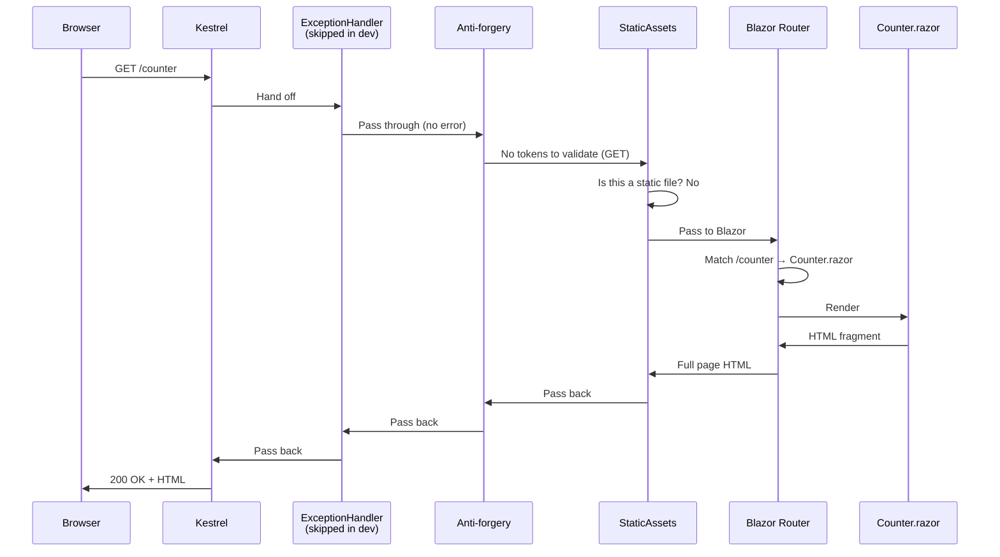

# Lesson 05 — Program.cs: The Startup Pipeline

> **Recap:** You've seen the shape of a Blazor project. `Program.cs` is the entry point — the first file that runs when the app starts.
>
> **This lesson:** Go through every line of `Program.cs` and explain what it does, what a "service" is, what "middleware" is, and how all of it connects to Blazor.

---

## The File, In Full

Here's the entire `Program.cs` the template generated:

```csharp
using LearnBlazor.Components;

var builder = WebApplication.CreateBuilder(args);

// Add services to the container.
builder.Services.AddRazorComponents()
    .AddInteractiveServerComponents();

var app = builder.Build();

// Configure the HTTP request pipeline.
if (!app.Environment.IsDevelopment())
{
    app.UseExceptionHandler("/Error", createScopeForErrors: true);
}


app.UseAntiforgery();

app.MapStaticAssets();
app.MapRazorComponents<App>()
    .AddInteractiveServerRenderMode();

app.Run();
```

It's 18 lines. But each line represents a very specific concept in ASP.NET Core. We'll break them into two groups and walk through both.

---

## The Two Phases

A `Program.cs` file in modern ASP.NET Core has two distinct phases:



**Phase 1: Building.** You tell the app "here are the tools I'll need" — database access, Blazor, logging, etc. This is called **service registration**.

**Phase 2: Running.** You define "for each incoming HTTP request, here's what to do" — handle errors, serve static files, route to Blazor components, etc. This is called the **middleware pipeline**.

The line `var app = builder.Build();` is the boundary. Before it = Phase 1. After it = Phase 2.

---

## Line-by-Line Walkthrough

### Line 1: The `using`

```csharp
using LearnBlazor.Components;
```

Imports the `LearnBlazor.Components` namespace so we can reference the `App` class without typing `LearnBlazor.Components.App`. The `App` class is the compiled form of `App.razor` (we'll see how Razor files become C# classes in Lesson 09).

---

### Line 3: Creating the builder

```csharp
var builder = WebApplication.CreateBuilder(args);
```

This is the single line that bootstraps an entire ASP.NET Core application. It creates a `WebApplicationBuilder` object with sensible defaults:



You get four things for free:
1. Configuration loaded from multiple sources (JSON, env, command-line)
2. A logging system
3. An empty dependency-injection (DI) container ready to accept services
4. A Kestrel-based web server ready to be configured

> **What is "dependency injection"?** A pattern where instead of `new`-ing things directly, you say "I need an X" in a constructor and the framework provides one for you. It makes code easier to test and swap. You don't need to understand it deeply yet — just know that `builder.Services` is where you register things to be injected later.

---

### Lines 6–7: Registering Blazor's services

```csharp
builder.Services.AddRazorComponents()
    .AddInteractiveServerComponents();
```

This is the Blazor-specific line. Let's split it in two:

**`AddRazorComponents()`** — Registers the services needed to **render** Razor components: the renderer, the component activator, the navigation manager, the cascading value accessor, etc. This alone gives you **static server-side rendering** — meaning the server can render components to HTML and send them to the browser. No interactivity though. The buttons wouldn't do anything if you stopped here.

**`AddInteractiveServerComponents()`** — Adds the services needed for **interactive** server-side rendering: the SignalR circuit handler, the render state serializer, the event dispatcher. This is what makes the Counter button actually work.

Think of it like this:

| Call | What you get |
|------|--------------|
| `AddRazorComponents()` | Ability to render Blazor components as HTML (static) |
| `+ AddInteractiveServerComponents()` | Ability to maintain live circuits with real-time updates |
| `+ AddInteractiveWebAssemblyComponents()` | Ability to ship components to run in the browser's WASM (not added here) |

If we wanted both Server and WebAssembly in the same app, we'd chain all three. The template only gives us Server because that's what we asked for with `--interactivity Server`.

---

### Line 9: Building the app

```csharp
var app = builder.Build();
```

**This is the boundary between the two phases.**

Calling `.Build()`:
1. Finalizes the service registrations (you can't add more after this)
2. Creates the actual `WebApplication` object
3. Gives you `app`, which you use for everything in Phase 2

After this line, `builder.Services` can no longer be modified. Everything you do with `app.*` is about **how requests are handled** rather than **what services exist**.

---

### Lines 12–15: The exception handler

```csharp
if (!app.Environment.IsDevelopment())
{
    app.UseExceptionHandler("/Error", createScopeForErrors: true);
}
```

This says: "If we're NOT in development mode, use a nice error page when exceptions occur."

Why the `if`? Because in development, you want to see the **raw stack trace** so you can debug. In production, you want to show the user a friendly `/Error` page and log the stack trace privately. This `if` gives you the right behavior in both environments automatically.

`createScopeForErrors: true` means "if an error happens, spin up a fresh DI scope for rendering the error page" — this is important because the scope that caused the error might be broken.

---

### Line 18: Anti-forgery middleware

```csharp
app.UseAntiforgery();
```

This protects against a web security problem called **Cross-Site Request Forgery (CSRF)**. In short: a malicious site could trick a logged-in user's browser into making a request to your site, and your site would happily act on it because the browser includes cookies automatically.

Anti-forgery protection generates a unique token per session, puts it in a hidden field in forms, and refuses any POST/PUT/DELETE that doesn't include the token. Since other sites can't read your token, they can't forge requests.

Blazor requires this middleware. If you remove it, forms will break. Don't remove it.

---

### Line 20: Static assets

```csharp
app.MapStaticAssets();
```

This is a **.NET 9** feature (new!) that serves files from `wwwroot/` with smart behavior:
- Fingerprints filenames with a content hash (`app.css` → `app.abc123.css`) for long-cache support
- Auto-compresses files (gzip, brotli)
- Sends proper cache headers

The pre-.NET-9 equivalent was `app.UseStaticFiles()`. `MapStaticAssets()` is strictly better — use it in any new project.

This is what enables `@Assets["app.css"]` in `App.razor` to resolve to the fingerprinted URL automatically.

---

### Lines 21–22: The star of the show

```csharp
app.MapRazorComponents<App>()
    .AddInteractiveServerRenderMode();
```

**This is the single most important line in the file.** It's what connects HTTP requests to Blazor.

Split into two parts:

**`MapRazorComponents<App>()`** — "Use `App.razor` as the root component. When any request comes in, render `App` and let Blazor's router (defined inside `App.razor`) figure out which page to show."

The type parameter `<App>` is a reference to the `App` class that was generated from `App.razor`.

**`AddInteractiveServerRenderMode()`** — "For components that declare `@rendermode InteractiveServer`, wire them up to the Blazor Server circuit infrastructure." This is the Phase 2 counterpart to the `AddInteractiveServerComponents()` call we made in Phase 1.



---

### Line 24: Start listening

```csharp
app.Run();
```

This is the "go" button. It starts the Kestrel web server listening on the port configured in `launchSettings.json` (typically something like `http://localhost:5234`). It blocks forever — the program doesn't exit until you Ctrl+C or the host shuts down.

Everything after this line would never execute.

---

## The Whole Picture

Let's visualize what `Program.cs` actually builds:



---

## What Happens When a Request Arrives

With the above setup, here's exactly what happens when a browser sends `GET /counter`:



This is called the **request pipeline** because each piece of middleware is a stage that the request passes through. Each stage can short-circuit the pipeline (e.g., anti-forgery can reject bad requests before they ever reach Blazor).

---

## What's NOT in This `Program.cs`

A real-world Blazor project's `Program.cs` usually has more things in it. For comparison, here's what you'd commonly add:

```csharp
// Database (Entity Framework)
builder.Services.AddDbContext<AppDbContext>(options =>
    options.UseSqlServer(builder.Configuration.GetConnectionString("Default")));

// HTTP client for calling external APIs
builder.Services.AddHttpClient();

// Authentication (logging in users)
builder.Services.AddAuthentication().AddCookie();
builder.Services.AddAuthorization();

// Your own business services
builder.Services.AddScoped<IWeatherService, WeatherService>();

// Rate limiting
builder.Services.AddRateLimiter(/* ... */);

// CORS (cross-origin requests from other sites)
builder.Services.AddCors(/* ... */);
```

And on the Phase-2 side:

```csharp
app.UseHttpsRedirection();
app.UseAuthentication();
app.UseAuthorization();
app.UseRateLimiter();
app.UseCors();
```

Don't memorize any of these yet. I'm showing them so you recognize them when you see them in real projects. The stock template is deliberately minimal so you can see the Blazor pieces without noise.

---

## Key Terms

| Term | Meaning |
|------|---------|
| **Phase 1 / Phase 2** | Before and after `builder.Build()`. Phase 1 = register services. Phase 2 = configure request handling. |
| **Service / DI container** | The collection of "tools" the app can use. You register them in Phase 1 and inject them later. |
| **Middleware** | A step in the request pipeline. Each middleware can inspect, modify, or reject a request. |
| **Pipeline** | The ordered chain of middleware that every request passes through. |
| **Kestrel** | The built-in web server that actually listens on ports. `app.Run()` starts Kestrel. |
| **`Add*()` methods** | Phase 1 — register services. Called on `builder.Services`. |
| **`Use*()` methods** | Phase 2 — add middleware. Called on `app`. |
| **`Map*()` methods** | Phase 2 — map URL patterns to handlers. Called on `app`. |
| **Anti-forgery** | Security feature that prevents other sites from forging requests on behalf of your users. |
| **Environment** | "Development", "Staging", "Production", etc. Controlled by the `ASPNETCORE_ENVIRONMENT` variable. |

---

## A Mnemonic for the Pattern

Every ASP.NET Core `Program.cs` follows the same rhythm:

```
CREATE builder
ADD services (Add*)
BUILD app
USE middleware (Use*)
MAP endpoints (Map*)
RUN
```

If you remember **"Create, Add, Build, Use, Map, Run,"** you can write a `Program.cs` from scratch.

---

## Try This

1. Open `LearnBlazor/Program.cs` in your editor.
2. Add this line right after `var app = builder.Build();`:
   ```csharp
   app.Use(async (context, next) =>
   {
       Console.WriteLine($"Request: {context.Request.Method} {context.Request.Path}");
       await next();
   });
   ```
3. Run the app: `cd LearnBlazor && dotnet run`
4. Navigate around. Watch your console. You'll see every HTTP request logged, including the ones for CSS, favicon, SignalR, and the pages themselves.

This is **custom middleware**. You just added a step to the request pipeline. Every middleware in Blazor works the same way — it's a function that receives a request, does something, and calls `next()` to pass it down the chain.

Remove this line before moving on (it was just a demo).

---

## Ready for Lesson 06?

You now understand how Blazor gets *started*. Next, we'll look at the **first thing Blazor actually renders**: `App.razor`. It's the only file in the project that contains a full HTML document, and a lot of invisible magic happens in it.

➡️ **Next: [Lesson 06 — App.razor and the Root HTML](06-app-razor-and-root-html.md)**
