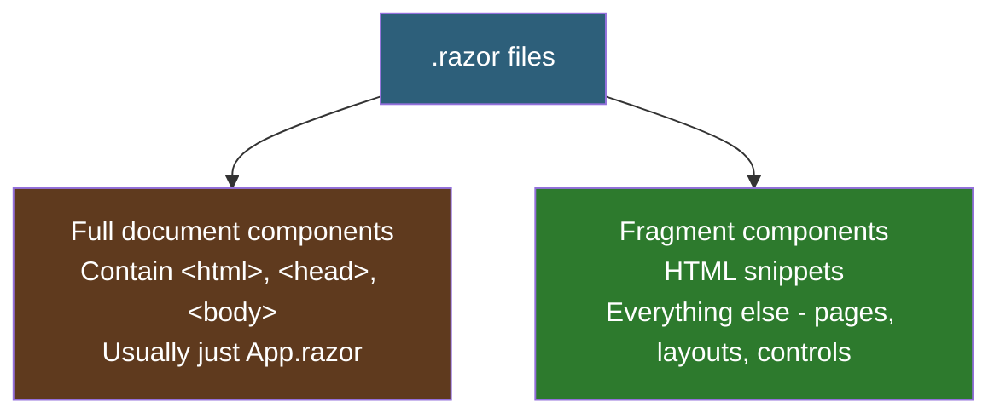
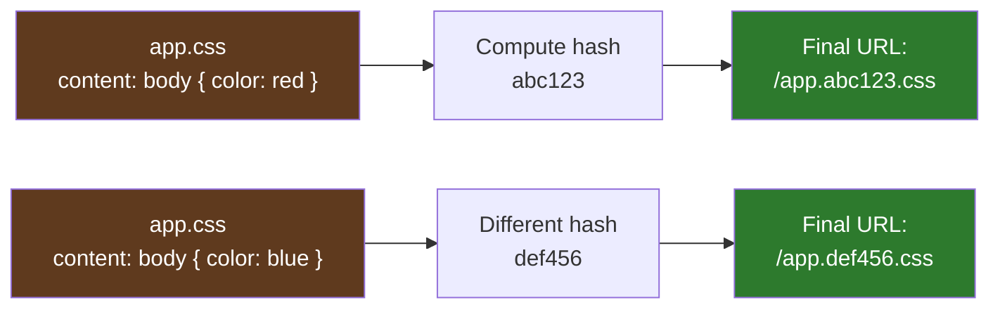
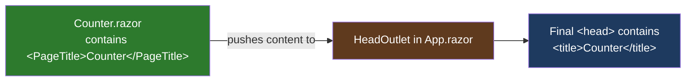
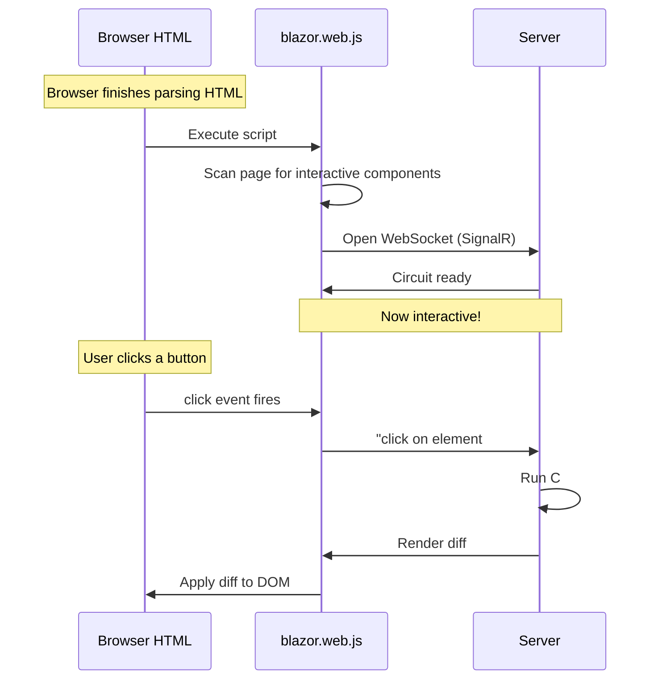
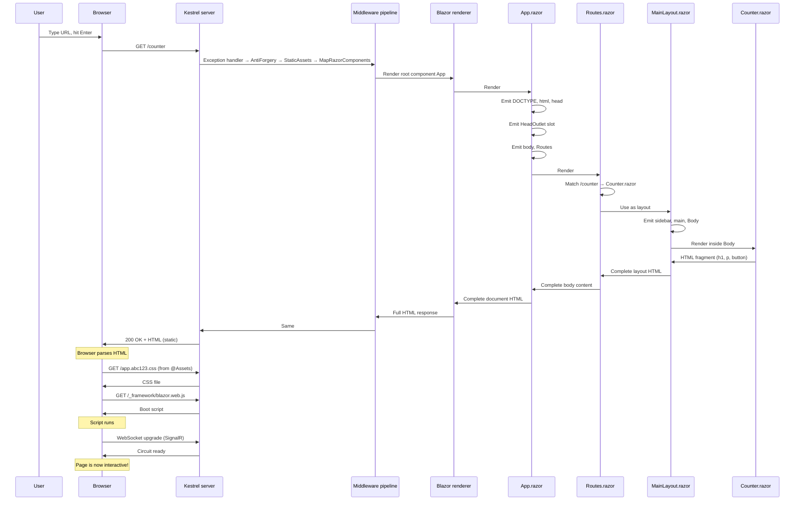

# Lesson 06 — App.razor and the Root HTML

> **Recap:** `Program.cs` configures services and middleware. The key line `app.MapRazorComponents<App>()` hands incoming requests off to `App.razor` as the root component.
>
> **This lesson:** Understand exactly what `App.razor` does, why it's the one file with a full HTML document, and how a single HTTP request becomes a rendered page in the browser.

---

## The Two Kinds of `.razor` Files

Before we read `App.razor`, understand this critical distinction:



**In most projects, `App.razor` is the only full-document component.** Every other `.razor` file just defines a piece of HTML that gets composed into the whole. `App.razor` is the outer frame of the picture; everything else slots inside it.

---

## The Full File

```razor
<!DOCTYPE html>
<html lang="en">

<head>
    <meta charset="utf-8" />
    <meta name="viewport" content="width=device-width, initial-scale=1.0" />
    <base href="/" />
    <link rel="stylesheet" href="@Assets["lib/bootstrap/dist/css/bootstrap.min.css"]" />
    <link rel="stylesheet" href="@Assets["app.css"]" />
    <link rel="stylesheet" href="@Assets["LearnBlazor.styles.css"]" />
    <ImportMap />
    <link rel="icon" type="image/png" href="favicon.png" />
    <HeadOutlet />
</head>

<body>
    <Routes />
    <script src="_framework/blazor.web.js"></script>
</body>

</html>
```

Short, but **every single line is load-bearing**. Let's walk through it.

---

## The Document Declaration

```html
<!DOCTYPE html>
<html lang="en">
```

Standard HTML. `<!DOCTYPE html>` tells the browser "this is HTML5" (vs ancient HTML4). `lang="en"` tells screen readers and search engines the page is in English.

Nothing Blazor-specific. This is exactly what every HTML file has started with for the past 15 years.

---

## `<head>`: Where Metadata Lives

The `<head>` section of any HTML document contains **metadata and assets** — things the browser needs to know about the page, but that aren't rendered as visible content.

```html
<meta charset="utf-8" />
```
Tells the browser to interpret bytes as UTF-8. Safe default; always do this.

```html
<meta name="viewport" content="width=device-width, initial-scale=1.0" />
```
Tells mobile browsers "don't zoom out — the page is already designed to fit the screen." Without this, mobile pages look like tiny desktop sites.

```html
<base href="/" />
```
**This one matters for Blazor.** The `<base>` tag tells the browser what the "root" URL is for relative links. Blazor's router uses it to correctly compute links like `<a href="counter">` — without `<base>`, `/counter` vs `counter` behaves differently depending on the current URL.

If you ever deploy your Blazor app to a subpath (like `example.com/myapp/`), you'd change this to `<base href="/myapp/" />`.

---

## `@Assets[...]`: Fingerprinted URLs

```html
<link rel="stylesheet" href="@Assets["lib/bootstrap/dist/css/bootstrap.min.css"]" />
<link rel="stylesheet" href="@Assets["app.css"]" />
<link rel="stylesheet" href="@Assets["LearnBlazor.styles.css"]" />
```

These three lines load CSS files. But notice the `@Assets[...]` wrapper — that's new Blazor (.NET 9+) syntax.

### What It Does

`@Assets["app.css"]` returns a URL that looks like `/app.abc123.css` — the filename has a **content hash** baked into it.



### Why It Matters

Without fingerprinting, browsers aggressively cache CSS files. If you change your CSS and deploy, users might still see the old version for days because their browser cached it under the same URL.

**With fingerprinting,** a change to the file changes the URL. The browser has never seen the new URL, so it fetches the new version immediately. Old CSS can stay cached effectively forever because its URL will never match anything new you deploy.

This is a very common web practice; Blazor just makes it easy.

---

## `<ImportMap />`: JavaScript Module Resolution

```html
<ImportMap />
```

This is a **Blazor component** (not a regular HTML tag — notice the PascalCase). It outputs an HTML5 `<script type="importmap">` block that tells the browser how to resolve JavaScript module imports.

You only care about this if you start using JavaScript modules via JS interop. For now, know that it's there and leave it alone.

---

## `<HeadOutlet />`: The Slot Pages Push To

```html
<HeadOutlet />
```

Another Blazor component. This one is **critical**.

`HeadOutlet` is a **slot** — a placeholder where other components can inject content into `<head>`. The most common use is `<PageTitle>`, which lets each page set the browser tab title:

```razor
@* In Counter.razor *@
<PageTitle>Counter</PageTitle>
```



Without `<HeadOutlet />` in `App.razor`, `<PageTitle>` in your pages wouldn't go anywhere.

You can push more than just titles — `<HeadContent>` lets pages add arbitrary `<meta>` tags, analytics scripts, etc.

---

## `<body>`: The Two Important Children

```html
<body>
    <Routes />
    <script src="_framework/blazor.web.js"></script>
</body>
```

Just two things inside `<body>`:

### `<Routes />`

A reference to the **`Routes.razor`** component, which contains the router. This is where **all your actual page content** goes.

When a user hits `/counter`, the router inside `<Routes />` matches the URL to `Counter.razor`, wraps it in `MainLayout`, and renders it inside this slot. When the URL is `/weather`, it becomes `Weather.razor` inside `MainLayout` instead. Same slot, different contents.

We'll dig into the `<Routes />` component itself in **Lesson 07**.

### `<script src="_framework/blazor.web.js">`

This is the **Blazor boot script**. It's a small JavaScript file (a few KB) that:

1. Detects which components on the page need interactivity
2. Opens a **SignalR WebSocket** back to the server
3. Handles DOM events (clicks, input, etc.) and forwards them to the server
4. Receives render diffs from the server and applies them to the DOM



**This script is the bridge between the static HTML the server delivered and the interactive "live" experience.**

Where does `_framework/blazor.web.js` come from? It's not a file on your disk. It's served dynamically by Blazor's middleware (set up by `app.MapRazorComponents<App>()`). The path `_framework/*` is reserved by Blazor.

---

## The Full First-Load Sequence

Here's the complete story of what happens when a user types `http://localhost:5234/counter` and hits Enter:



That's the whole first-load story in one picture.

---

## One Component Tree, Many Files

After all that rendering, the "component tree" looks like this — just objects in memory on the server:

```mermaid
flowchart TB
    App[App.razor]
    App --> HO[HeadOutlet]
    App --> Routes[Routes.razor]
    Routes --> Router[Router]
    Router --> RouteView[RouteView]
    RouteView --> Layout[MainLayout.razor]
    Layout --> NavMenu[NavMenu.razor]
    Layout --> Body[@Body slot]
    Body --> Counter[Counter.razor]

    style App fill:#5f3a1e,color:#fff
    style Routes fill:#2d5f7a,color:#fff
    style Layout fill:#2d7a2d,color:#fff
    style Counter fill:#7a2d5f,color:#fff
```

Each box is a **component instance** — an actual C# object in memory. Blazor walks this tree to generate HTML, and later walks it again to compute diffs when state changes.

Understanding this tree is half the battle. Every later lesson builds on it.

---

## What Makes `App.razor` Special

Most `.razor` files just emit HTML fragments. `App.razor` is different in two ways:

### 1. It has `<!DOCTYPE html>` and `<html>`

No other component does. Only one file in your project should output a complete HTML document, and by convention that's `App.razor`.

### 2. It's passed to `MapRazorComponents<App>()`

Look back at Program.cs:

```csharp
app.MapRazorComponents<App>()
    .AddInteractiveServerRenderMode();
```

The `<App>` type parameter is what makes `App.razor` the root. If you renamed it to `RootDocument.razor`, you'd rename the class to `RootDocument` and pass `<RootDocument>` here. There's nothing magical about the name "App" — it's just convention.

---

## What If I Want Multiple Pages With Different Layouts?

You don't change `App.razor` for that. `App.razor` stays the same. What changes is the **routing and layouts** inside `<Routes />`. We'll see this in Lessons 07 and 08.

`App.razor` is almost never edited after project creation. It's infrastructure.

---

## Key Terms

| Term | Meaning |
|------|---------|
| **Root component** | The single top-level component that contains the full HTML document. Usually `App.razor`. |
| **`@Assets[...]`** | Helper that returns a fingerprinted URL for a file in `wwwroot/`. Enables long-term caching. |
| **Fingerprinted URL** | A URL with a content hash, so changes to the file change the URL, busting browser caches. |
| **`<HeadOutlet />`** | A slot in `<head>` where pages can inject `<title>`, `<meta>`, etc. via `<PageTitle>` and `<HeadContent>`. |
| **`<PageTitle>`** | A component that sets the browser tab title for the current page. |
| **`<Routes />`** | Blazor's router component — matches URLs to page components. |
| **Blazor boot script** | `blazor.web.js` — the tiny JavaScript file that connects the browser to Blazor's circuit. |
| **Component tree** | The hierarchy of component instances in memory — App contains Routes contains MainLayout contains Counter, etc. |

---

## Try This

1. Open `Components/App.razor`.
2. Inside the `<head>`, add a meta description right after the viewport line:
   ```html
   <meta name="description" content="My first Blazor app" />
   ```
3. Open `Components/Pages/Counter.razor`. Change the title:
   ```razor
   <PageTitle>Counter — LearnBlazor</PageTitle>
   ```
4. Run the app: `cd LearnBlazor && dotnet run`
5. Open the Counter page. **View Source** in the browser. Notice:
   - Your `<meta name="description">` is in the HTML
   - The `<title>` tag now says "Counter — LearnBlazor" — that came from `<PageTitle>` via `<HeadOutlet />`
   - The script tag for `blazor.web.js` is there
   - The CSS paths look like `app.<hash>.css` (fingerprinted)

All of this came from the 18 lines in `App.razor`.

---

## Ready for Lesson 07?

You now understand the root HTML document. Next: how Blazor actually figures out which page to show when a URL comes in. This is called **routing**, and it's what makes `/counter` different from `/weather`.

➡️ **Next: [Lesson 07 — Routing and Navigation](07-routing.md)**
