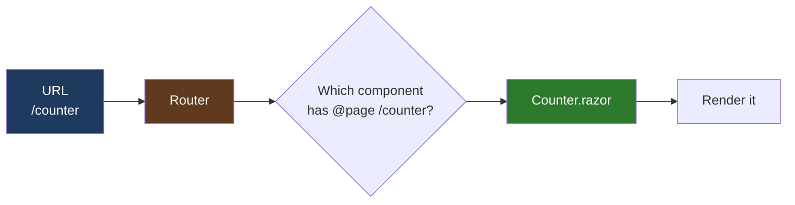
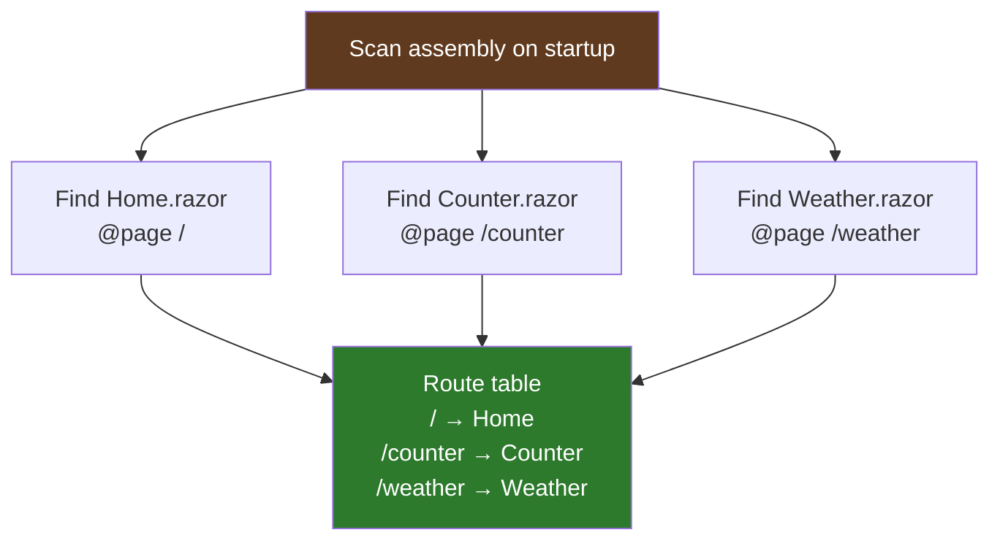
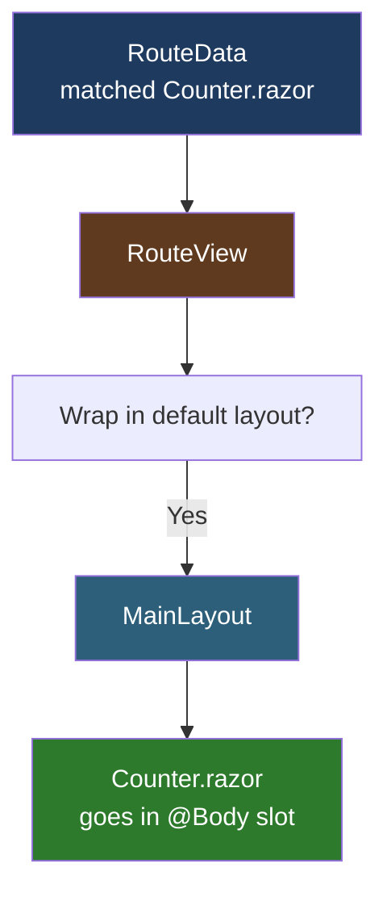
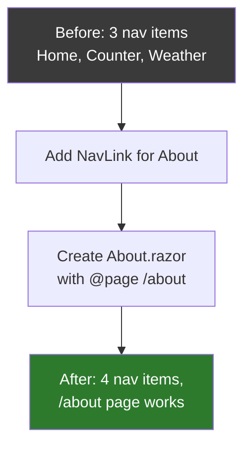

# Lesson 07 — Routing and Navigation

> **Recap:** `App.razor` contains the root HTML. Inside its `<body>` there's a `<Routes />` component. We skipped over it last lesson — now it's time to open it up.
>
> **This lesson:** Understand how Blazor matches URLs to components, how to define your own pages, how to navigate between them, and what happens during a navigation.

---

## What "Routing" Means

Every web app has to answer this question:

> "The user went to `/counter`. Which code should run?"

That's **routing** — mapping URLs to code. In a Blazor app, the code is a component. So routing is specifically:

> "Given a URL, which `.razor` component should I render?"



---

## The Routes.razor File

Here's the whole `Routes.razor` file from our template:

```razor
<Router AppAssembly="typeof(Program).Assembly">
    <Found Context="routeData">
        <RouteView RouteData="routeData" DefaultLayout="typeof(Layout.MainLayout)" />
        <FocusOnNavigate RouteData="routeData" Selector="h1" />
    </Found>
</Router>
```

Five components in four lines. Let's unpack each one.

---

### The `<Router>` Component

```razor
<Router AppAssembly="typeof(Program).Assembly">
```

This is Blazor's built-in router. It takes one parameter: `AppAssembly`, which tells it **where to look for routable components**.

At startup, `<Router>` scans the specified assembly (in this case, `LearnBlazor.dll`) for any class with a `[Route]` attribute — which is what the `@page` directive compiles into. It builds an internal lookup table like this:



When a request comes in, the router consults this table, picks the right component, and renders it.

---

### `<Found>` vs `<NotFound>`

The `<Router>` has two possible outcomes — either it found a component for the URL or it didn't. The template uses `<Found>` to define what happens on a match. (`<NotFound>` also exists but is being phased out in favor of using Status Code Pages middleware.)

```razor
<Found Context="routeData">
    ...
</Found>
```

`Context="routeData"` is Razor syntax for "when rendering this block, introduce a variable called `routeData` that holds information about the matched route." That variable is then used inside the block.

`routeData` contains:
- Which component was matched
- Any route parameters (we'll get to those)
- Which layout to use

---

### `<RouteView>`: Rendering the Matched Component

```razor
<RouteView RouteData="routeData" DefaultLayout="typeof(Layout.MainLayout)" />
```

`RouteView` is the component that actually renders whatever the router matched. You pass it two things:

1. **`RouteData`** — the info about the matched route (from `Context="routeData"` above)
2. **`DefaultLayout`** — which layout to wrap the page in if the page doesn't specify its own

`DefaultLayout="typeof(Layout.MainLayout)"` means "unless a page declares `@layout SomeOther`, wrap it in `MainLayout.razor`." This is how every page gets the sidebar and main content area automatically.



---

### `<FocusOnNavigate>`: Accessibility Magic

```razor
<FocusOnNavigate RouteData="routeData" Selector="h1" />
```

This is a small but important component. After every navigation, it **moves keyboard focus to the first `<h1>` on the page**. Why?

Without this, screen reader users (blind or low-vision folks) wouldn't know the page changed — their focus would still be on the link they just clicked, which is about to disappear. `FocusOnNavigate` makes Blazor apps accessible to assistive technology.

You rarely touch this component. It just works.

---

## How You Define a Page: The `@page` Directive

```razor
@page "/counter"

<h1>Counter</h1>
...
```

That's it. **Put `@page "/url"` at the top of any `.razor` file and it becomes a routable page.** The router will find it when scanning the assembly.

Multiple pages can even share the same URL template:

```razor
@page "/product/{id:int}"
```

The `{id:int}` part is a **route parameter** — the router will match `/product/42` and make `id = 42` available as a property on the component.

### Route Parameter Examples

| Template | Matches | Parameter |
|----------|---------|-----------|
| `/about` | `/about` | (none) |
| `/product/{id}` | `/product/anything` | `string id` |
| `/product/{id:int}` | `/product/42` | `int id` (must be integer) |
| `/user/{name}/posts` | `/user/alice/posts` | `string name = "alice"` |
| `/blog/{year:int}/{month:int}` | `/blog/2026/4` | `int year, int month` |

To receive the parameter in your C# code, declare a public property with matching name marked `[Parameter]`:

```razor
@page "/product/{id:int}"

<h1>Product @Id</h1>

@code {
    [Parameter]
    public int Id { get; set; }
}
```

We'll cover parameters in depth in Lesson 09. For now, just know route parameters exist.

---

## Navigating Between Pages

You know how to define pages. How do users get from one to another?

### Option 1: `<NavLink>` — The Smart Anchor

This is what the template's `NavMenu.razor` uses:

```razor
<NavLink class="nav-link" href="counter">
    Counter
</NavLink>
```

`NavLink` is Blazor's enhanced `<a>` tag. It automatically adds an `active` CSS class when the current URL matches its `href`, so you can style the "current page" indicator in CSS.

**`NavLinkMatch`** controls how matching works:

| Value | Meaning | Example |
|-------|---------|---------|
| `NavLinkMatch.Prefix` (default) | Active if current URL **starts with** `href` | `/blog` matches `/blog/post1` |
| `NavLinkMatch.All` | Active only if URL **exactly matches** `href` | `/` must match only `/`, not everything |

You use `Match="NavLinkMatch.All"` on the Home link so it's not active on every page (because every URL starts with `/`).

### Option 2: Regular `<a href="...">`

You can use plain `<a>` tags. They work. They just won't auto-highlight when active. Use them for links that go to **external sites**, since `<a>` on an internal link would cause a full-page reload instead of a smooth client-side navigation.

```razor
<a href="https://microsoft.com" target="_blank">External link</a>
<NavLink href="counter">Internal link</NavLink>
```

### Option 3: `NavigationManager` (Programmatic Navigation)

Sometimes you want to navigate from C# code — e.g., after saving a form, redirect to a detail page. For that, inject the `NavigationManager`:

```razor
@page "/new-product"
@inject NavigationManager Navigation

<button @onclick="SaveAndRedirect">Save</button>

@code {
    private void SaveAndRedirect()
    {
        // ... save logic ...
        Navigation.NavigateTo("/products");
    }
}
```

`NavigationManager` is also where you read the current URL, listen for navigation events, and navigate back in history:

```csharp
Navigation.NavigateTo("/login");               // Go somewhere
Navigation.NavigateTo("/login", forceLoad: true); // Full page reload
var currentUrl = Navigation.Uri;               // Read current URL
Navigation.LocationChanged += OnLocationChanged; // Listen for navigation
```

---

## What Happens During a Navigation

Let's trace exactly what happens when a user on the Home page clicks the "Counter" `NavLink`:

```mermaid
sequenceDiagram
    participant U as User
    participant Link as NavLink component
    participant JS as blazor.web.js
    participant Nav as NavigationManager
    participant Router as Router
    participant Old as Current page (Home)
    participant New as Counter page

    U->>Link: Click
    Link->>JS: Intercept click<br/>(don't let browser reload)
    JS->>Nav: URL changed to /counter
    Nav->>Router: Raise LocationChanged event
    Router->>Router: Look up /counter in route table
    Router->>Old: Dispose current page
    Router->>New: Create and render Counter
    New->>JS: New HTML
    JS->>U: Page content swapped
    Note over U: User sees Counter page<br/>but the whole page<br/>did NOT reload
```

The critical difference from traditional websites: **the browser did not do a full page reload**. The `<html>`, `<head>`, `<body>`, and layout stayed in memory. Only the content inside `@Body` was swapped out. This is why Blazor apps feel fast and smooth.

---

## Demonstrating It Yourself

Here's the most instructive experiment you can do:

1. Open Chrome DevTools → Network tab.
2. Check the "Preserve log" checkbox.
3. Navigate to your Blazor app's home page.
4. Click the "Counter" nav link.
5. Look at the Network tab.

You'll see basically **no new HTTP requests**. The URL changed, the page content changed, but no new GET /counter was sent. Why? Because Blazor intercepted the click and navigated **client-side**. The new component was rendered on the server and streamed to the browser over the SignalR WebSocket — not as an HTTP request.

Compare this to clicking an external `<a>` link — you'd see the browser fully reload and fetch everything fresh.

---

## Adding a New Page (End-to-End)

Let's add an `/about` page. Three steps:

### Step 1: Create the page component

Create `Components/Pages/About.razor`:

```razor
@page "/about"

<PageTitle>About</PageTitle>

<h1>About This Site</h1>

<p>I am learning Blazor with this tutorial.</p>
<p>I am a brand new C# developer.</p>
```

That's it. Save the file. If the app is running with hot reload, the page is already live. You can navigate to `/about` in the browser immediately.

### Step 2: Add it to the nav menu

Edit `Components/Layout/NavMenu.razor` and add a new `NavLink`:

```razor
<div class="nav-item px-3">
    <NavLink class="nav-link" href="about">
        About
    </NavLink>
</div>
```

### Step 3: (Optional) Add an icon

Bootstrap Icons come with the template. Use one:

```razor
<NavLink class="nav-link" href="about">
    <span class="bi bi-info-circle-nav-menu" aria-hidden="true"></span> About
</NavLink>
```

Visualized:



This is the whole "add a page" workflow. Three small edits and you're done.

---

## Routing Edge Cases Worth Knowing

### Multiple `@page` Directives

A single component can respond to multiple URLs:

```razor
@page "/"
@page "/home"
@page "/start"
```

All three URLs render the same component.

### Catch-All Routes

```razor
@page "/docs/{*path}"

@code {
    [Parameter] public string Path { get; set; }
}
```

The `*` means "match everything remaining, including slashes." So `/docs/foo/bar/baz` matches with `Path = "foo/bar/baz"`.

### Constraints Beyond `:int`

| Constraint | Matches | Type |
|------------|---------|------|
| `{x:int}` | integers | `int` |
| `{x:long}` | long integers | `long` |
| `{x:bool}` | true/false | `bool` |
| `{x:datetime}` | ISO dates | `DateTime` |
| `{x:guid}` | GUIDs | `Guid` |
| `{x:decimal}` | decimals | `decimal` |

---

## Key Terms

| Term | Meaning |
|------|---------|
| **Routing** | Matching a URL to a component |
| **`<Router>`** | Blazor's built-in router component. Scans assemblies at startup for routable components. |
| **`@page "/url"`** | Directive that makes a component routable at the given URL. |
| **Route parameter** | A dynamic part of a URL, like `{id}`, bound to a component property. |
| **Route constraint** | Restricts a parameter to a type, like `{id:int}`. |
| **`<RouteView>`** | The component that renders the matched page inside a layout. |
| **`<NavLink>`** | An enhanced `<a>` tag that auto-highlights when its URL matches the current location. |
| **`NavLinkMatch.All`** | Exact-match mode for NavLink. Used on the Home link to avoid always-active behavior. |
| **`NavigationManager`** | A service you inject to read the current URL and navigate programmatically. |
| **Client-side navigation** | Blazor intercepts link clicks and swaps content without a full page reload. |

---

## Try This

1. Add the `/about` page (all three steps above). Verify it shows up in the nav.
2. Add a `/contact` page with any content.
3. Create a **Product** page with a route parameter:

```razor
@page "/product/{id:int}"

<PageTitle>Product @Id</PageTitle>

<h1>Product Details</h1>
<p>You are viewing product number <strong>@Id</strong>.</p>
<a href="/product/@(Id + 1)">Next product</a>
|
<a href="/product/@(Id - 1)">Previous product</a>

@code {
    [Parameter]
    public int Id { get; set; }
}
```

Navigate to `/product/5`. Click "Next product". Notice that:
- The URL changes to `/product/6`
- The `Id` parameter changes
- The page re-renders with new content
- The browser didn't reload

You just made your first **data-driven, dynamic** Blazor page.

---

## Ready for Lesson 08?

You know how to define pages, navigate between them, and pass route parameters. Next, we'll dig into **layouts** — the shared page chrome that appears on every page. You've already seen `MainLayout.razor`; now we'll understand how it actually works.

➡️ **Next: [Lesson 08 — Layouts and Nested Content](08-layouts.md)**
