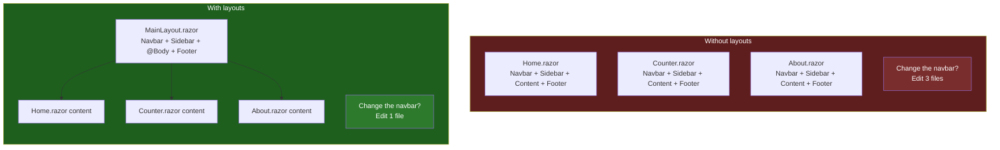
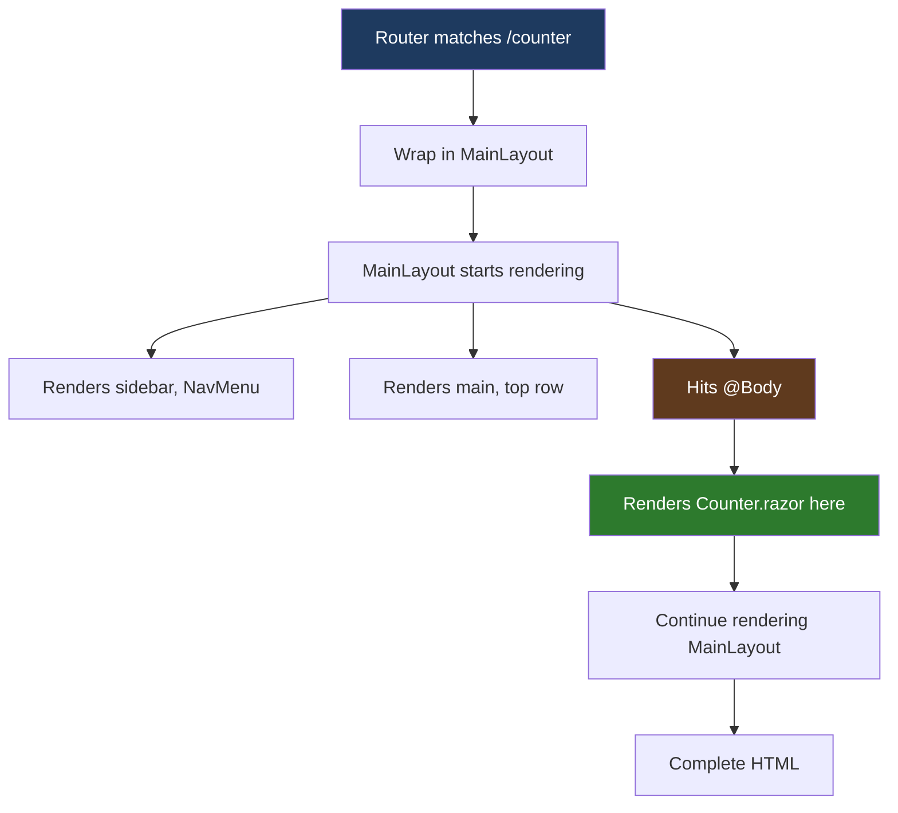

# Lesson 08 — Layouts and Nested Content

> **Recap:** The router matches URLs to pages, and `<RouteView>` wraps the matched page in a layout (default: `MainLayout.razor`).
>
> **This lesson:** Understand exactly what a layout is, how `@Body` works, how to compose layouts, and how to override the default for specific pages.

---

## The Problem Layouts Solve

Every website has **chrome** — stuff that appears on every page. The navigation bar at the top, the sidebar, the footer, the logo. You don't want to copy-paste these into every page. You want to **define them once** and have every page automatically show them.

That's what a layout is.



---

## What a Layout Actually Is

A layout is just **a component** with two small differences:

1. It inherits from `LayoutComponentBase` (via `@inherits`)
2. It uses `@Body` somewhere in its markup as a placeholder for the content that'll be slotted in

Here's the entire `MainLayout.razor`:

```razor
@inherits LayoutComponentBase

<div class="page">
    <div class="sidebar">
        <NavMenu />
    </div>

    <main>
        <div class="top-row px-4">
            <a href="https://learn.microsoft.com/aspnet/core/" target="_blank">About</a>
        </div>

        <article class="content px-4">
            @Body
        </article>
    </main>
</div>

<div id="blazor-error-ui" data-nosnippet>
    An unhandled error has occurred.
    <a href="." class="reload">Reload</a>
    <span class="dismiss">🗙</span>
</div>
```

Let's break it down.

---

### `@inherits LayoutComponentBase`

```razor
@inherits LayoutComponentBase
```

This one line makes the component a layout. `LayoutComponentBase` is a base class Blazor provides that has a `Body` property (a `RenderFragment`), which is the "hole" where the page's content will go.

When the router says "render `Counter.razor` inside `MainLayout`," Blazor does this:

```csharp
// Conceptually:
var layout = new MainLayout();
layout.Body = RenderFragmentThatRendersCounter;
Render(layout);
```

Then when `MainLayout` encounters `@Body` in its markup, it executes the render fragment — and the Counter's HTML appears at that spot.

---

### The Layout Structure

Ignoring the C#, the HTML structure is:

```html
<div class="page">
    <div class="sidebar">
        <!-- sidebar content goes here -->
    </div>
    <main>
        <!-- top bar + page content go here -->
    </main>
</div>
```

Visualized:

```mermaid
flowchart TB
    subgraph page[div.page]
        subgraph sidebar[div.sidebar]
            NM[NavMenu<br/>Home, Counter, Weather]
        end
        subgraph main[main]
            TR[Top row<br/>About link]
            Content[article.content<br/>@Body ← page content slots here]
        end
    end

    style page fill:#1e3a5f,color:#fff
    style sidebar fill:#2d5f7a,color:#fff
    style main fill:#5f3a1e,color:#fff
    style Content fill:#2d7a2d,color:#fff
```

Everything except `@Body` is **fixed** — it appears identically on every page. The `@Body` slot is where the **page-specific content** goes.

---

### `@Body` Is Where the Magic Happens

```razor
<article class="content px-4">
    @Body
</article>
```

`@Body` is the placeholder. When `MainLayout` is rendered:



You can only have **one `@Body`** per layout. (If you need multiple slots, that's a different mechanism called `RenderFragment` parameters, which we'll see in Lesson 09.)

---

## The `NavMenu.razor` Component

`MainLayout` uses a `<NavMenu />` component for the sidebar. This is a **normal component** (not a layout), and it's just a way of keeping the layout file tidy.

```razor
<div class="top-row ps-3 navbar navbar-dark">
    <div class="container-fluid">
        <a class="navbar-brand" href="">LearnBlazor</a>
    </div>
</div>

<div class="nav-scrollable" onclick="document.querySelector('.navbar-toggler').click()">
    <nav class="nav flex-column">
        <div class="nav-item px-3">
            <NavLink class="nav-link" href="" Match="NavLinkMatch.All">
                <span class="bi bi-house-door-fill-nav-menu" aria-hidden="true"></span> Home
            </NavLink>
        </div>
        ...
    </nav>
</div>
```

Nothing special about it — it's just HTML plus some `NavLink` components. It could have been inlined directly into `MainLayout.razor`, but extracting it into its own file makes both files easier to read.

**Takeaway:** Layouts can compose other components. You could have:
- `MainLayout` using `<NavMenu />` and `<Footer />`
- `AdminLayout` using `<AdminNavMenu />` and `<Footer />`
- Both reusing `<Footer />` from a single `Footer.razor`

---

## The Error UI

```razor
<div id="blazor-error-ui" data-nosnippet>
    An unhandled error has occurred.
    <a href="." class="reload">Reload</a>
    <span class="dismiss">🗙</span>
</div>
```

This is the **disconnected UI** that appears if the Blazor Server SignalR circuit drops. By default it's hidden (via CSS) and only shown when Blazor detects a disconnect.

You can customize the text. You can move it to `App.razor` if you want it outside the layout. But the default is fine for learning.

---

## How Pages Get Wrapped In Layouts

We saw this briefly in Lesson 07. Here's the full picture:

### The default path

```mermaid
flowchart LR
    URL[/counter] --> Router[Router]
    Router --> RV[RouteView]
    RV --> Check{Does Counter.razor<br/>have @layout?}
    Check -->|No| Default[Use DefaultLayout<br/>= MainLayout]
    Check -->|Yes| Override[Use the declared layout]
    Default --> Render[Render Counter<br/>inside MainLayout]
    Override --> Render

    style URL fill:#1e3a5f,color:#fff
    style Render fill:#2d7a2d,color:#fff
```

The `DefaultLayout` is set in `Routes.razor`:

```razor
<RouteView RouteData="routeData" DefaultLayout="typeof(Layout.MainLayout)" />
```

If no page overrides the layout, **every page uses `MainLayout`**.

### Overriding the layout for a specific page

Say you want a login page that's full-screen and has no sidebar. Create an `EmptyLayout.razor`:

```razor
@inherits LayoutComponentBase

<div class="empty-layout">
    @Body
</div>
```

Then in `Login.razor`:

```razor
@page "/login"
@layout EmptyLayout

<h1>Log in</h1>
<form>...</form>
```

Now `/login` uses `EmptyLayout`, while every other page still uses `MainLayout`.

```mermaid
flowchart TB
    URL1[/counter] --> RV1[RouteView]
    RV1 --> ML[MainLayout<br/>default]
    ML --> Counter

    URL2[/login] --> RV2[RouteView]
    RV2 --> Check[Login has @layout EmptyLayout]
    Check --> EL[EmptyLayout]
    EL --> Login

    style URL1 fill:#1e3a5f,color:#fff
    style URL2 fill:#1e3a5f,color:#fff
    style ML fill:#2d5f7a,color:#fff
    style EL fill:#5f3a1e,color:#fff
```

---

## Nested Layouts

Layouts can themselves have layouts. This is rare but occasionally useful.

Imagine you have:
- `MainLayout` (sidebar + content)
- `AdminLayout` (inherits from `MainLayout`, adds an "Admin" banner + tab bar)

`AdminLayout.razor`:

```razor
@inherits LayoutComponentBase
@layout MainLayout

<div class="admin-banner">Admin Area</div>
<div class="admin-tabs">
    <a href="/admin/users">Users</a>
    <a href="/admin/reports">Reports</a>
</div>

<div class="admin-content">
    @Body
</div>
```

Now:
- A page with `@layout AdminLayout` renders inside `AdminLayout`
- `AdminLayout` itself renders inside `MainLayout` (because of its own `@layout MainLayout`)
- The page content ends up inside `AdminLayout`'s `@Body`, which is itself inside `MainLayout`'s `@Body`

```mermaid
flowchart TB
    Page[AdminUsers.razor<br/>@layout AdminLayout] --> AL[AdminLayout<br/>@layout MainLayout]
    AL --> ML[MainLayout<br/>@inherits LayoutComponentBase]
    ML --> Body1[@Body slot]
    Body1 --> AL2[AdminLayout banner,<br/>tabs, and @Body slot]
    AL2 --> Body2[@Body slot]
    Body2 --> Content[Actual page content]

    style Page fill:#7a2d5f,color:#fff
    style AL fill:#5f3a1e,color:#fff
    style ML fill:#2d5f7a,color:#fff
    style Content fill:#2d7a2d,color:#fff
```

You probably won't need this for weeks or months, but it's good to know it exists.

---

## Applying a Layout to a Whole Folder

Instead of putting `@layout` in every individual page, you can put it in `_Imports.razor` for a folder:

```razor
@* Components/Pages/Admin/_Imports.razor *@
@layout LearnBlazor.Components.Layout.AdminLayout
```

Now every page in `Components/Pages/Admin/` uses `AdminLayout` by default. Clean.

---

## What "Page Chrome" Typically Contains

For reference, here are the things usually placed in a main layout:

| Piece | Example |
|-------|---------|
| Navigation | Top bar, sidebar, breadcrumbs |
| Branding | Logo, app name |
| User info | "Logged in as Alice", avatar, logout button |
| Notifications | Toast messages, alert banners |
| Footer | Copyright, links to privacy/terms |
| Modal host | A slot for dialog popups to render into |
| Theme switcher | Dark mode toggle |

The current template only has navigation + an external "About" link, but a real app's layout is usually busier.

---

## Key Terms

| Term | Meaning |
|------|---------|
| **Layout** | A component that wraps page content with shared "chrome" (sidebar, header, etc.) |
| **`@inherits LayoutComponentBase`** | Directive that makes a component a layout |
| **`@Body`** | Placeholder in a layout where the wrapped page's content appears |
| **`DefaultLayout`** | The layout used by pages that don't specify their own, set on `<RouteView>` |
| **`@layout X`** | Directive on a page (or folder `_Imports.razor`) that overrides the default layout |
| **`LayoutComponentBase`** | Base class for layouts. Provides the `Body` property. |
| **Nested layouts** | Layouts that themselves have layouts, letting you compose chrome. |

---

## Try This

1. **Change the brand.** Open `NavMenu.razor` and change "LearnBlazor" to "My App". Refresh. See it in the sidebar.

2. **Add a footer to the layout.** Edit `MainLayout.razor` and add this just before `</main>`:
   ```razor
   <footer class="px-4 py-2 text-muted">
       <small>© 2026 My App</small>
   </footer>
   ```
   Refresh any page. The footer appears on every one, without editing a single page file. That's the power of layouts.

3. **Create an alternate layout.** Make `Components/Layout/EmptyLayout.razor`:
   ```razor
   @inherits LayoutComponentBase

   <div style="padding: 2rem; max-width: 600px; margin: 0 auto;">
       @Body
   </div>
   ```

4. **Use it for a specific page.** Edit `Components/Pages/About.razor` (the one you made in Lesson 07) and add `@layout EmptyLayout` right after the `@page` line:
   ```razor
   @page "/about"
   @layout EmptyLayout
   ```
   Navigate to `/about`. Notice: no sidebar! Navigate back to `/counter`. Sidebar is back.

5. **(Optional)** Put the `@layout` in a folder-wide `_Imports.razor` instead.

---

## Ready for Lesson 09?

You now understand the **big picture**: Program.cs starts the app, App.razor is the root document, Routes.razor maps URLs, layouts provide chrome, pages slot into layouts. The last piece is understanding **what a component actually is** — what's really happening inside those `.razor` files.

➡️ **Next: [Lesson 09 — Components Deep Dive](09-components.md)**
