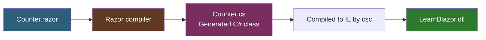
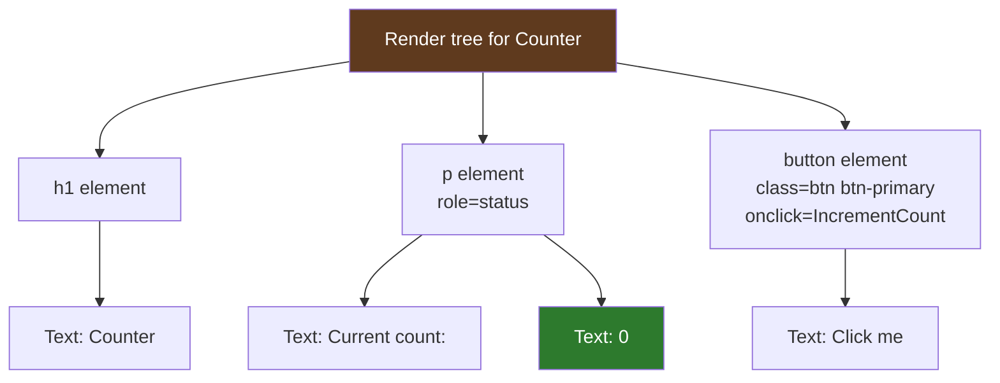
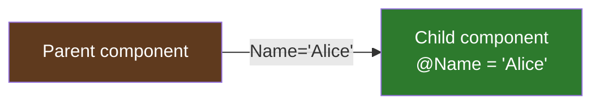
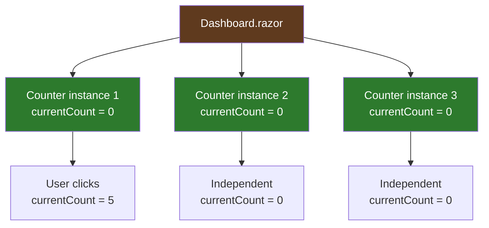
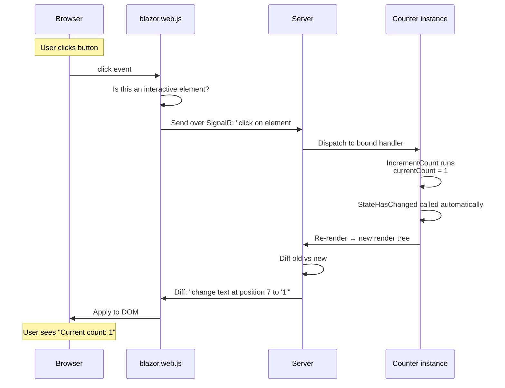
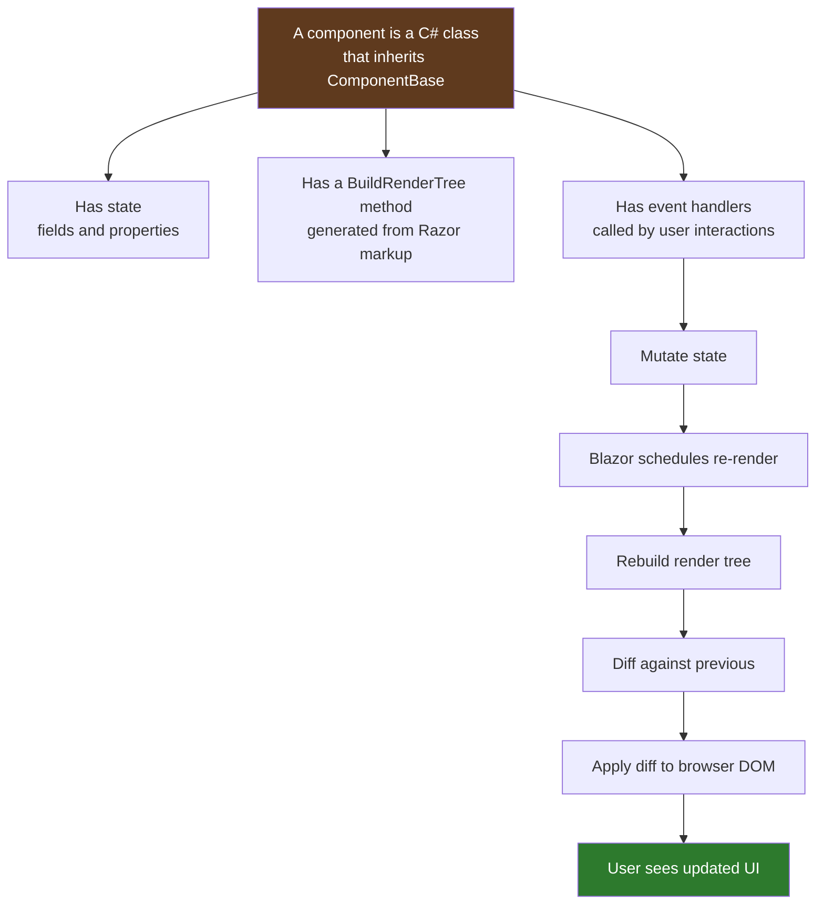

# Lesson 09 — Components Deep Dive

> **Recap:** You've seen pages, layouts, routing, and the overall architecture. Every `.razor` file is a "component" — but what *is* a component, really?
>
> **This lesson:** Understand components from the inside out. We'll use `Counter.razor` as our specimen and dissect it completely.

---

## The One-Sentence Definition

**A Blazor component is a C# class that produces HTML.**

That's the whole thing. Everything else — the Razor syntax, the `@code` block, the parameters, the lifecycle — is just decoration on that central idea.

Let's make it real by looking at what a `.razor` file actually is.

---

## Counter.razor: The Full File

```razor
@page "/counter"
@rendermode InteractiveServer

<PageTitle>Counter</PageTitle>

<h1>Counter</h1>

<p role="status">Current count: @currentCount</p>

<button class="btn btn-primary" @onclick="IncrementCount">Click me</button>

@code {
    private int currentCount = 0;

    private void IncrementCount()
    {
        currentCount++;
    }
}
```

Nineteen lines. There is a lot packed in here. Let's go line by line.

---

## What Is Actually In a `.razor` File

A `.razor` file has three kinds of content, mixed freely:

```mermaid
flowchart TB
    Razor[.razor file]
    Razor --> Dir[Directives<br/>@page, @rendermode, @inject]
    Razor --> Markup[Markup<br/>HTML with @ expressions]
    Razor --> Code[C# code<br/>@code block]

    style Razor fill:#2d5f7a,color:#fff
    style Dir fill:#5f3a1e,color:#fff
    style Markup fill:#2d7a2d,color:#fff
    style Code fill:#7a2d5f,color:#fff
```

### 1. Directives

Lines that start with `@word`. They configure the component at build time.

```razor
@page "/counter"
@rendermode InteractiveServer
```

- `@page "/counter"` — makes this component routable
- `@rendermode InteractiveServer` — enables interactivity for this component

Other common directives: `@using`, `@inject`, `@inherits`, `@implements`, `@attribute`, `@layout`.

### 2. Markup

Regular HTML, with C# values interpolated using `@`:

```razor
<p role="status">Current count: @currentCount</p>
```

The `@currentCount` grabs the C# variable `currentCount` and inserts its value into the HTML at render time.

### 3. The `@code` Block

The C# that backs the component:

```razor
@code {
    private int currentCount = 0;

    private void IncrementCount()
    {
        currentCount++;
    }
}
```

Inside `@code { }` you can write **any** C# code — fields, methods, properties, classes, nested types. It's just regular C#.

---

## The Compilation Magic

Here's the critical thing most tutorials skip: **a `.razor` file is compiled into a C# class at build time**.



When you build the project, the Razor compiler turns `Counter.razor` into something **approximately** like this (simplified):

```csharp
[Route("/counter")]
[RenderModeInteractiveServer]
public partial class Counter : ComponentBase
{
    private int currentCount = 0;

    private void IncrementCount()
    {
        currentCount++;
    }

    protected override void BuildRenderTree(RenderTreeBuilder __builder)
    {
        // <PageTitle>Counter</PageTitle>
        __builder.OpenComponent<PageTitle>(0);
        __builder.AddAttribute(1, "ChildContent", (RenderFragment)((__builder2) => {
            __builder2.AddContent(2, "Counter");
        }));
        __builder.CloseComponent();

        // <h1>Counter</h1>
        __builder.AddMarkupContent(3, "<h1>Counter</h1>");

        // <p role="status">Current count: @currentCount</p>
        __builder.OpenElement(4, "p");
        __builder.AddAttribute(5, "role", "status");
        __builder.AddContent(6, "Current count: ");
        __builder.AddContent(7, currentCount);
        __builder.CloseElement();

        // <button @onclick="IncrementCount">Click me</button>
        __builder.OpenElement(8, "button");
        __builder.AddAttribute(9, "class", "btn btn-primary");
        __builder.AddAttribute(10, "onclick",
            EventCallback.Factory.Create<MouseEventArgs>(this, IncrementCount));
        __builder.AddContent(11, "Click me");
        __builder.CloseElement();
    }
}
```

**You never see this code.** The compiler generates it and throws it in the `obj/` folder. But understanding that it exists is the key to understanding Blazor.

Every `.razor` file becomes a **`ComponentBase` subclass** with:
- Your `@code` members as regular class members
- A `BuildRenderTree` method that describes the component's HTML output
- Attributes from your directives (`[Route]`, etc.)

---

## The Render Tree: Not HTML

Notice that `BuildRenderTree` doesn't return HTML. It calls methods like `OpenElement`, `AddAttribute`, `AddContent`. These build a **render tree** — an in-memory description of the output, kind of like a virtual DOM.



Why a render tree instead of direct HTML? **So Blazor can diff it efficiently.**

When the user clicks the button and `currentCount` becomes `1`, Blazor:
1. Re-runs `BuildRenderTree` to get a new render tree
2. Compares it to the previous render tree (the diff)
3. Figures out the minimal set of changes: "just change text node at position X from '0' to '1'"
4. Sends only that tiny diff over the SignalR connection
5. The browser applies the diff to the real DOM

This is why Blazor Server can be fast despite round-tripping to the server — the messages flying over the wire are tiny.

---

## Fields and Methods: Just Regular C#

Everything inside `@code { }` is regular C# class membership. The two members of `Counter` are:

```csharp
private int currentCount = 0;

private void IncrementCount()
{
    currentCount++;
}
```

- `currentCount` is a **field** — private state that belongs to this component instance
- `IncrementCount` is a **method** — called when the button is clicked

These aren't special in any way. You could add properties, static methods, nested classes, constructors, disposable resources — anything C# lets you do in a class.

### Fields vs Properties

You can use either:

```csharp
private int currentCount = 0;        // field
public int Count { get; set; } = 0;  // property
```

**Rules of thumb:**
- Use **private fields** for internal state that only this component manages (like `currentCount`)
- Use **public properties with `[Parameter]`** for values that should be passed in from a parent component

Which leads us to...

---

## Parameters: Passing Data to a Component

A **parameter** is a way to pass a value from a parent component into a child. Here's a tiny component that accepts a parameter:

```razor
@* Greeting.razor *@
<p>Hello, @Name!</p>

@code {
    [Parameter]
    public string Name { get; set; } = "World";
}
```

Used from another component:

```razor
<Greeting Name="Alice" />
<Greeting Name="Bob" />
<Greeting />  @* uses default "World" *@
```

Renders:

```html
<p>Hello, Alice!</p>
<p>Hello, Bob!</p>
<p>Hello, World!</p>
```

The rules:
1. **Property must be `public`**
2. **Property must have `[Parameter]` attribute**
3. **Property must have `{ get; set; }`**
4. You can set a default value

### Parameter Flow Is Always Parent → Child



The parent *provides* the value. The child *receives* it. Parameters are one-way: child never changes the parent's variable by modifying its own parameter.

To communicate **back** to the parent (like "the user clicked something in me!"), you use **event callbacks** — which are parameters of type `EventCallback`. We'll see that later.

---

## Using a Component From Another Component

Once `Counter.razor` exists, you can use `<Counter />` anywhere just like a built-in HTML tag. Let's prove it. Create a new page:

```razor
@page "/dashboard"

<h1>Dashboard</h1>

<p>Here are three counters on one page:</p>

<Counter />
<Counter />
<Counter />
```

You'll get three fully-functional counters, **each with its own independent state**. Clicking one doesn't affect the others.



**Each `<Counter />` is a new `Counter` object in memory.** Each has its own `currentCount` field. This is the same way objects work in C# — `new Counter()` and `new Counter()` are independent.

This is why components are powerful: they're **reusable, self-contained units of UI**.

---

## Why the Counter Needs `@rendermode InteractiveServer`

Look at this line, which you haven't seen explained yet:

```razor
@rendermode InteractiveServer
```

Without it, `Counter.razor` would render as **static HTML**. You'd see the heading, the paragraph with "Current count: 0", and the button — but clicking the button would do **nothing**.

Why? Because by default in .NET 8+, Blazor renders components as **static server-side HTML** for performance and SEO. Interactive behavior has to be opted into per-component using `@rendermode`.

```mermaid
flowchart TB
    Default[Default: Static SSR] --> Fast[Fast, cacheable, SEO-friendly<br/>but NO interactivity]
    Opt[@rendermode InteractiveServer] --> Slower[Opens a SignalR circuit<br/>enables @onclick, state changes]

    style Default fill:#3a3a3a,color:#fff
    style Opt fill:#5f3a1e,color:#fff
    style Fast fill:#7a7a2d,color:#000
    style Slower fill:#2d7a2d,color:#fff
```

**Why not just make everything interactive by default?** Because interactive components require a live connection, consume server memory per user, and add latency. A static marketing page doesn't need any of that. Render modes let you opt in only where needed.

We dig into render modes in depth in **Lesson 11**. For now, the rule is: **if a component has `@onclick` or changes state, it needs `@rendermode InteractiveServer`.**

---

## The `@onclick` Mechanism

Let's zoom in on this one line:

```razor
<button class="btn btn-primary" @onclick="IncrementCount">Click me</button>
```

The `@onclick` directive is how Razor says "when this element fires a `click` event, call the following C# method." It's the Blazor equivalent of `onclick="..."` in plain HTML, but instead of JavaScript, you reference a C# method.

Under the hood (simplified):



Important: the method name is **not a string**. It's a C# expression. So you could write more complex things:

```razor
<button @onclick="() => count++">Inline lambda</button>
<button @onclick="@(() => Increment(5))">Pass arguments</button>
<button @onclick="IncrementCount">Method reference</button>
```

### Event Arguments

Event handlers can accept the event args:

```razor
<button @onclick="HandleClick">Click</button>

@code {
    private void HandleClick(MouseEventArgs e)
    {
        Console.WriteLine($"Clicked at {e.ClientX}, {e.ClientY}");
    }
}
```

Blazor provides strongly-typed versions of all the common event args: `MouseEventArgs`, `KeyboardEventArgs`, `ChangeEventArgs`, `FocusEventArgs`, etc.

### Other Event Handlers

Every DOM event has an `@on...` equivalent:

```razor
<input @oninput="HandleInput" />
<div @onmouseover="ShowTooltip">Hover me</div>
<form @onsubmit="Save">...</form>
<input @onkeypress="CheckKey" />
```

And of course, you can bind multiple events on the same element.

---

## Re-Rendering: The StateHasChanged Trick

When `IncrementCount` runs, `currentCount++` happens. But how does the UI actually update? Who re-renders the component?

**Answer: Blazor automatically calls `StateHasChanged()` after any event handler.**

`StateHasChanged()` is a method on every `ComponentBase`. When called, it marks the component as "dirty" and schedules a re-render. The renderer then runs `BuildRenderTree` again, diffs against the previous tree, and sends the diff to the browser.

**For event handlers, this is automatic.** You don't write `StateHasChanged()` inside `IncrementCount` — Blazor wraps every event handler and calls it for you.

When do you have to call it manually? Only when state changes **outside** of an event handler — for example, from a timer callback, a background `Task`, or another component's notification. We'll see this in Lesson 12 (Lifecycle).

---

## A Mental Model for Components

Put everything together, and here's your mental model:



**Every interactive Blazor component follows this cycle.** It's the single most important thing to understand in this entire tutorial.

---

## Key Terms

| Term | Meaning |
|------|---------|
| **Component** | A C# class (inheriting from `ComponentBase`) that produces HTML |
| **`.razor` file** | The authoring format for a component — mixes HTML, C# expressions, and `@code` |
| **`@code { }`** | The block where you write the C# backing the component |
| **`ComponentBase`** | The built-in base class for all Blazor components |
| **`BuildRenderTree`** | The auto-generated method that produces the component's render tree |
| **Render tree** | An in-memory description of a component's HTML output, used for diffing |
| **Parameter** | A `[Parameter]`-marked public property that lets parents pass data into a component |
| **Field** | Private state owned by a single component instance |
| **`@onclick`** | Directive that binds a DOM event to a C# method |
| **`StateHasChanged()`** | Method that marks a component as dirty, causing a re-render |
| **`@rendermode InteractiveServer`** | Directive that makes a component interactive via a Blazor Server circuit |
| **Component tree** | The hierarchy of component instances in memory, parent containing children |

---

## Try This

### Exercise 1: Build a Reusable Greeting component

1. Create `Components/Shared/Greeting.razor`:
   ```razor
   <div class="alert alert-success">
       <h3>Hello, @Name!</h3>
       <p>You are @Age years old.</p>
   </div>

   @code {
       [Parameter]
       public string Name { get; set; } = "Stranger";

       [Parameter]
       public int Age { get; set; } = 0;
   }
   ```

2. Use it in `Components/Pages/Home.razor`:
   ```razor
   @page "/"

   <PageTitle>Home</PageTitle>

   <h1>Hello, world!</h1>

   <Greeting Name="Joel" Age="35" />
   <Greeting Name="Alice" Age="28" />
   <Greeting />
   ```

   > Note: `Components/Shared/` isn't a required folder — it's a convention. Components are found automatically regardless of folder, as long as they're in the right namespace.

### Exercise 2: Build a reusable Counter component that takes a start value

1. Copy `Counter.razor` to `Components/Shared/MyCounter.razor` and modify it:
   ```razor
   @rendermode InteractiveServer

   <div class="my-counter">
       <p>@Label: <strong>@currentCount</strong></p>
       <button class="btn btn-sm btn-primary" @onclick="IncrementCount">+1</button>
   </div>

   @code {
       [Parameter]
       public string Label { get; set; } = "Count";

       [Parameter]
       public int StartValue { get; set; } = 0;

       private int currentCount;

       protected override void OnInitialized()
       {
           currentCount = StartValue;
       }

       private void IncrementCount() => currentCount++;
   }
   ```

2. Use it on the home page:
   ```razor
   <MyCounter Label="Apples" StartValue="5" />
   <MyCounter Label="Bananas" StartValue="10" />
   <MyCounter Label="Cherries" />
   ```

Run the app. Each counter has its own state. Increment one — the others don't change. This is **component composition**, and it's the main thing you'll do as a Blazor developer.

---

## Ready for Lesson 10?

You now understand what components *are*. The next lesson is a reference for every piece of Razor syntax you'll encounter so you can read any `.razor` file fluently.

➡️ **Next: [Lesson 10 — Razor Syntax Reference](10-razor-syntax.md)**
