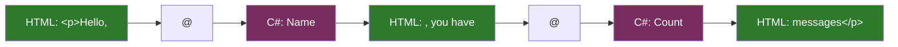

# Lesson 10 — Razor Syntax Reference

> **Recap:** A component is a C# class that produces HTML. Razor is the authoring syntax for writing those components.
>
> **This lesson:** A reference for every piece of Razor syntax. Use this as a lookup any time you see `@something` and aren't sure what it does.

---

## The Core Idea of Razor

Razor is a templating language that lets you **mix HTML and C# in the same file**. A single character — `@` — is how Razor switches between the two.

```razor
<p>Hello, @Name, you have @Count messages</p>
```

The `@` says "the next thing is C#, not HTML." Razor reads until it figures out where the C# expression ends, then flips back to HTML.



Razor's rule: **everything after `@` is C# until Razor can figure out the expression is done.**

---

## The Categories of Razor Syntax

Razor has several distinct features, all spelled with `@`:

```mermaid
flowchart TB
    Razor[Razor syntax]
    Razor --> Dir[Directives<br/>@page, @inject]
    Razor --> Expr[Expressions<br/>@name]
    Razor --> Stmt[Statements<br/>@if, @foreach]
    Razor --> Code["Code blocks<br/>@code, @{}"]
    Razor --> Attr[Attributes<br/>@onclick, @bind]

    style Razor fill:#5f3a1e,color:#fff
    style Dir fill:#1e3a5f,color:#fff
    style Expr fill:#2d7a2d,color:#fff
    style Stmt fill:#7a7a2d,color:#000
    style Code fill:#7a2d5f,color:#fff
    style Attr fill:#2d5f7a,color:#fff
```

Let's cover each category with examples.

---

## 1. Directives (Configure the Component)

Directives always go **at the top of the file** and configure compile-time behavior. Here's the full list you'll see in Blazor:

### `@page` — Make it routable
```razor
@page "/counter"
@page "/product/{id:int}"
```
Covered in Lesson 07.

### `@layout` — Override the default layout
```razor
@layout EmptyLayout
```
Covered in Lesson 08.

### `@rendermode` — Control interactivity mode
```razor
@rendermode InteractiveServer
@rendermode InteractiveWebAssembly
@rendermode InteractiveAuto
```
Full deep dive in Lesson 11.

### `@inherits` — Inherit from a different base class
```razor
@inherits LayoutComponentBase        @* For layouts *@
@inherits MyCustomComponentBase      @* For your own base classes *@
```
You only use this for layouts or when you've built a shared base class.

### `@using` — Import a namespace (just like C#'s `using`)
```razor
@using System.Text.Json
@using MyApp.Models
```
Lets you reference types from other namespaces without fully qualifying them.

### `@inject` — Get a service from dependency injection
```razor
@inject NavigationManager Navigation
@inject HttpClient Http
@inject IJSRuntime JS
```
We'll cover DI more later. For now: think of it as "give me an instance of this thing to use in my component."

### `@attribute` — Add an attribute to the generated class
```razor
@attribute [StreamRendering]
@attribute [Authorize]
```
Adds C# attributes to the component's compiled class. Used for things like authorization and streaming.

### `@implements` — Implement a C# interface
```razor
@implements IDisposable
```
Used when you need to clean up resources (unsubscribe from events, dispose timers). If you declare `@implements IDisposable`, you add a `Dispose()` method in `@code`.

### `@typeparam` — Make the component generic
```razor
@typeparam T

<ul>
    @foreach (var item in Items)
    {
        <li>@item</li>
    }
</ul>

@code {
    [Parameter] public IEnumerable<T> Items { get; set; }
}
```
Advanced feature — makes a component work with any type `T`.

---

## 2. Expressions (Insert Values into Markup)

These are the most common Razor syntax — inserting a C# value into HTML.

### Simple expression
```razor
<p>Hello, @name!</p>
<p>The year is @DateTime.Now.Year</p>
<p>@count items in cart</p>
```

Razor reads the identifier and any dotted access (`.Now.Year`) as the expression.

### Parenthesized expression
Use parentheses when the expression has spaces or operators that would confuse Razor:

```razor
<p>Next year: @(DateTime.Now.Year + 1)</p>
<p>Name: @(user?.Name ?? "Anonymous")</p>
<p>Upper: @(name.ToUpper())</p>
```

Without the parens, Razor would stop at the space or the operator.

### Escaping `@`

If you literally want an `@` in your HTML, write `@@`:

```razor
<p>Email me at joel@@example.com</p>
```

### HTML encoding

Razor **automatically HTML-encodes** expressions. If `@name` is `<script>alert('xss')</script>`, it gets rendered as text (`&lt;script&gt;...`), not as a real script. This protects against cross-site scripting attacks.

To insert **raw HTML** (dangerous — only if you trust the source), use `@((MarkupString)htmlString)`.

---

## 3. Control Flow Statements

Razor lets you use regular C# control flow structures to affect what HTML is emitted.

### `@if` / `else if` / `else`
```razor
@if (user.IsLoggedIn)
{
    <p>Welcome, @user.Name!</p>
}
else if (user.IsPending)
{
    <p>Your account is pending.</p>
}
else
{
    <p>Please log in.</p>
}
```

Braces `{ }` are required even for single-line bodies.

### `@for` (counting loop)
```razor
<ol>
    @for (int i = 1; i <= 10; i++)
    {
        <li>Item @i</li>
    }
</ol>
```

### `@foreach` (collection loop)
```razor
<ul>
    @foreach (var product in products)
    {
        <li>@product.Name — $@product.Price</li>
    }
</ul>
```

### `@while` and `@do-while`
```razor
@while (condition)
{
    <p>Still going</p>
}
```

Rare in UI code, but works.

### `@switch`
```razor
@switch (status)
{
    case "active":
        <span class="green">Active</span>
        break;
    case "paused":
        <span class="yellow">Paused</span>
        break;
    default:
        <span class="red">Unknown</span>
        break;
}
```

### `@try / @catch`
```razor
@try
{
    var data = GetData();
    <p>@data</p>
}
catch (Exception ex)
{
    <p class="error">Failed: @ex.Message</p>
}
```

---

## 4. Code Blocks

### The `@code { }` block

The main place for your component's C#. Everything inside becomes a member of the generated class:

```razor
@code {
    private int count = 0;
    private string name = "";

    private void Increment() => count++;

    protected override async Task OnInitializedAsync()
    {
        name = await FetchName();
    }

    private async Task<string> FetchName() => "World";
}
```

You can have **multiple `@code` blocks** if you prefer, though most components use just one.

### Inline code block `@{ ... }`

Sometimes you need a few lines of code **in the middle of markup**:

```razor
<ul>
    @{
        var filtered = products.Where(p => p.InStock).ToList();
        var title = filtered.Any() ? "In Stock" : "Out of Stock";
    }
    <h3>@title</h3>
    @foreach (var p in filtered)
    {
        <li>@p.Name</li>
    }
</ul>
```

Note: `@{ }` blocks don't produce any HTML — they're pure logic. Use them sparingly; usually you should put logic in `@code` instead.

---

## 5. Event and Binding Attributes

### `@on{event}` — Event handlers
```razor
<button @onclick="Save">Save</button>
<input @oninput="HandleChange" />
<form @onsubmit="Submit">...</form>
<div @onmouseover="ShowTip" @onmouseout="HideTip">Hover me</div>
```

Any DOM event works: `click`, `dblclick`, `focus`, `blur`, `keydown`, `keypress`, `input`, `change`, `submit`, etc.

### Event modifiers
```razor
<button @onclick="Save" @onclick:preventDefault>Save</button>
<div @onclick="Outer" @onclick:stopPropagation>
    <button @onclick="Inner">Click</button>
</div>
```

- `:preventDefault` — like JavaScript's `event.preventDefault()`
- `:stopPropagation` — like JavaScript's `event.stopPropagation()`

### `@bind` — Two-way data binding
```razor
<input @bind="name" />
<p>You typed: @name</p>
```

This creates a **two-way binding**: the input's value is set from `name`, and changes to the input update `name`. Convenient.

By default, `@bind` updates on the `change` event (when the input loses focus). To update on every keystroke, use `@bind:event`:

```razor
<input @bind="name" @bind:event="oninput" />
```

### `@bind:after` — Run code after binding
```razor
<input @bind="search" @bind:event="oninput" @bind:after="OnSearchChanged" />

@code {
    private string search = "";
    private async Task OnSearchChanged() { /* fetch results */ }
}
```

This runs `OnSearchChanged` after every update to `search` — a clean way to implement things like live search.

### `@bind-{Parameter}` — Two-way binding with child components

```razor
<ChildComponent @bind-Value="myValue" />
```

This binds the parent's `myValue` to the child component's `Value` parameter, automatically updating both sides when either changes. The child needs to expose a matching `ValueChanged` event callback. Covered in detail in advanced component composition.

---

## 6. Generic Attribute Splatting

Sometimes you want to pass a bunch of attributes through to a child HTML element dynamically:

```razor
<button @attributes="buttonAttributes" @onclick="Click">Click me</button>

@code {
    private Dictionary<string, object> buttonAttributes = new()
    {
        { "class", "btn btn-primary" },
        { "data-id", "42" },
        { "disabled", true }
    };
}
```

`@attributes="dictionary"` spreads the dictionary entries onto the element as attributes.

---

## 7. Special Razor Constructs

### Comments — `@* ... *@`
Razor-only comments (not emitted to HTML):

```razor
@* This note is only visible in source, not in the rendered page *@
<p>Visible text</p>
```

Contrast with HTML comments (`<!-- -->`) which **do** get sent to the browser.

### Explicit transitions with `<text>`
If you're in a code block and want to emit plain text without wrapping it in HTML:

```razor
@code {
    var mode = "light";
}

<p>
    @if (mode == "light")
    {
        <text>Light mode is on</text>
    }
</p>
```

`<text>` is a Razor-only element — it doesn't appear in the output.

---

## Razor's Rules for Finding Where C# Ends

A question that comes up: how does Razor know where an expression ends?

```razor
<p>Hello, @name !</p>          @* name is the expression *@
<p>@name.ToUpper()</p>          @* name.ToUpper() is the expression *@
<p>@(name + "!")</p>            @* parens explicit *@
<p>Next: @(count + 1) items</p> @* parens explicit *@
```

The rules:
- Razor reads identifiers, dots, and method calls without parens
- Spaces end the expression
- Operators like `+`, `-`, `?` end the expression
- Use `@(...)` to force explicit boundaries

If you get a weird compile error, the fix is usually to wrap the expression in parentheses.

---

## A Complete Example Using Many Syntax Features

```razor
@page "/products/{category}"
@inject HttpClient Http
@inject NavigationManager Nav
@implements IDisposable

<PageTitle>@Category Products</PageTitle>

<h1>@Category Products</h1>

@if (isLoading)
{
    <p>Loading...</p>
}
else if (products == null || !products.Any())
{
    <p>No products found.</p>
}
else
{
    <input @bind="filter" @bind:event="oninput" placeholder="Filter..." />

    <ul>
        @foreach (var p in FilteredProducts)
        {
            <li>
                <strong>@p.Name</strong>
                — @p.Price.ToString("C")
                <button @onclick="() => Buy(p.Id)">Buy</button>
            </li>
        }
    </ul>

    <p>Showing @FilteredProducts.Count() of @products.Count()</p>
}

@code {
    [Parameter]
    public string Category { get; set; } = "";

    private List<Product>? products;
    private string filter = "";
    private bool isLoading = true;

    private IEnumerable<Product> FilteredProducts =>
        products?.Where(p => p.Name.Contains(filter, StringComparison.OrdinalIgnoreCase))
                 ?? Enumerable.Empty<Product>();

    protected override async Task OnParametersSetAsync()
    {
        isLoading = true;
        products = await Http.GetFromJsonAsync<List<Product>>($"api/products/{Category}");
        isLoading = false;
    }

    private void Buy(int id) => Nav.NavigateTo($"/checkout/{id}");

    public void Dispose() { /* cleanup */ }

    private class Product
    {
        public int Id { get; set; }
        public string Name { get; set; } = "";
        public decimal Price { get; set; }
    }
}
```

Syntax elements used: `@page` with route parameter, `@inject`, `@implements`, `<PageTitle>`, `@Category` expression, `@if/else if/else`, `@foreach`, `@bind` with `@bind:event`, `@onclick` with inline lambda, `@code`, `[Parameter]`, `protected override`, nested class, `$"..."` interpolation, LINQ, and more.

If you can read this file top to bottom and understand every piece, **you've got the hang of Razor**.

---

## Cheat Sheet

| Syntax | Purpose | Example |
|--------|---------|---------|
| `@identifier` | Output a C# value | `@name` |
| `@(expression)` | Output a more complex expression | `@(a + b)` |
| `@@` | Literal `@` character | `user@@host` |
| `@*...*@` | Razor comment (not in output) | `@* TODO *@` |
| `@if { }` | Conditional | `@if (x) { <p>yes</p> }` |
| `@for { }` | For loop | `@for (var i = 0; i < 10; i++) { }` |
| `@foreach { }` | Foreach loop | `@foreach (var x in list) { }` |
| `@switch { }` | Switch statement | `@switch (x) { case 1: ... break; }` |
| `@code { }` | C# backing code | `@code { private int x = 0; }` |
| `@{ }` | Inline code block | `@{ var y = x * 2; }` |
| `@page "..."` | Routable page | `@page "/about"` |
| `@layout X` | Override layout | `@layout EmptyLayout` |
| `@rendermode X` | Set render mode | `@rendermode InteractiveServer` |
| `@inject T name` | Get a service | `@inject HttpClient Http` |
| `@using N` | Import namespace | `@using System.Text.Json` |
| `@inherits T` | Inherit from base | `@inherits LayoutComponentBase` |
| `@implements I` | Implement interface | `@implements IDisposable` |
| `@attribute [A]` | Add class attribute | `@attribute [Authorize]` |
| `@onclick="X"` | Event handler | `@onclick="Save"` |
| `@bind="X"` | Two-way bind | `@bind="name"` |
| `@bind:event="X"` | Bind on specific event | `@bind:event="oninput"` |
| `@attributes="dict"` | Splat attributes | `@attributes="extra"` |

---

## Try This

Open `Components/Pages/Counter.razor` and modify it to use more Razor syntax:

```razor
@page "/counter"
@rendermode InteractiveServer

<PageTitle>Counter</PageTitle>

<h1>Counter</h1>

<p role="status">Current count: @currentCount</p>

@if (currentCount > 10)
{
    <p class="text-success">You clicked a lot!</p>
}
else if (currentCount > 5)
{
    <p class="text-warning">Halfway there.</p>
}

<button class="btn btn-primary" @onclick="IncrementCount">+1</button>
<button class="btn btn-secondary" @onclick="Reset">Reset</button>
<button class="btn btn-info" @onclick="@(() => currentCount += 10)">+10</button>

<hr />

<label>
    Step size:
    <input type="number" @bind="stepSize" @bind:event="oninput" />
</label>
<p>Step is @stepSize</p>

@code {
    private int currentCount = 0;
    private int stepSize = 1;

    private void IncrementCount() => currentCount += stepSize;

    private void Reset() => currentCount = 0;
}
```

Run the app, navigate to `/counter`, and experiment:
- The conditional messages appear/disappear as you change the count
- The `+10` button uses an inline lambda
- The step size input is two-way bound, so changing it affects subsequent increments
- The `@bind:event="oninput"` makes the step update instantly (not just on blur)

This single file uses **nine different Razor features**. If this makes sense, you can read any Blazor code.

---

## Ready for Lesson 11?

You've seen `@rendermode InteractiveServer` a few times but haven't really understood it. That's the topic of the next lesson — it's one of the most important concepts in modern Blazor (.NET 8+).

➡️ **Next: [Lesson 11 — Render Modes and Interactivity](11-render-modes.md)**
