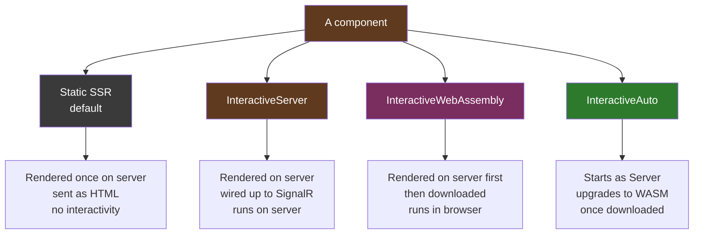
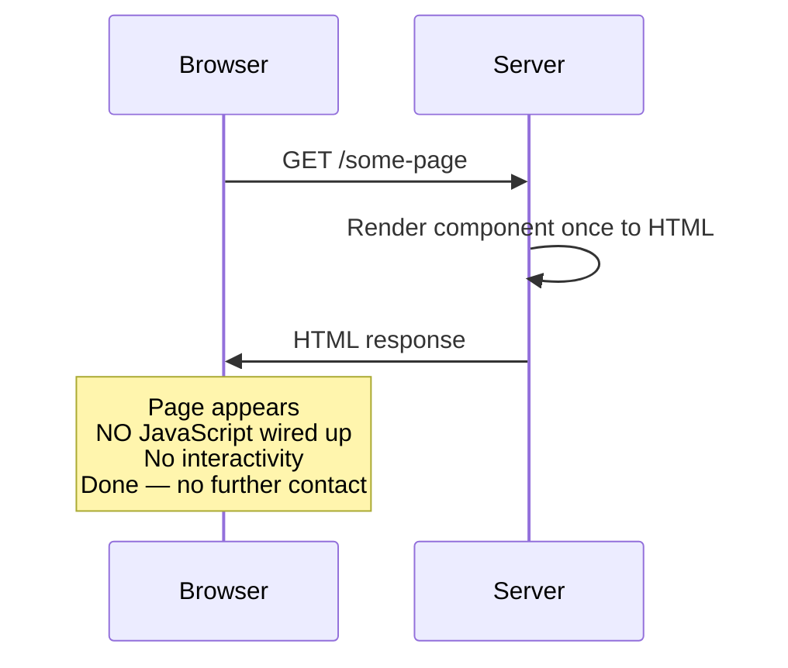
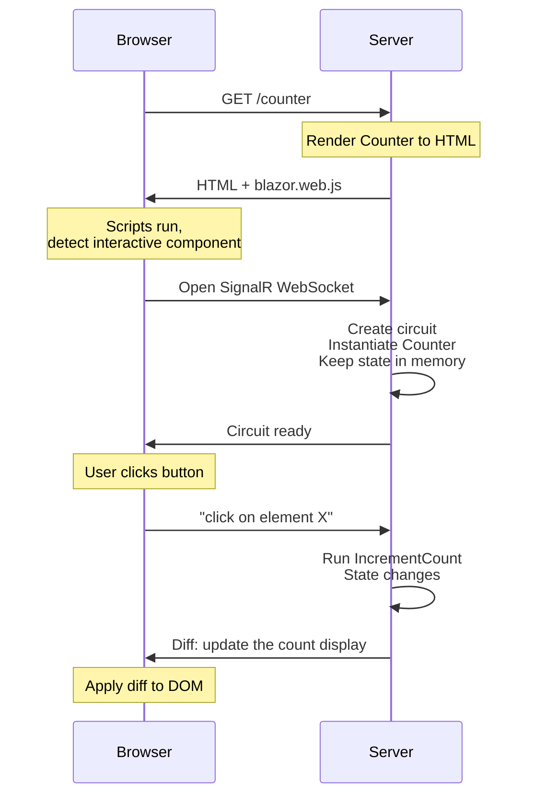
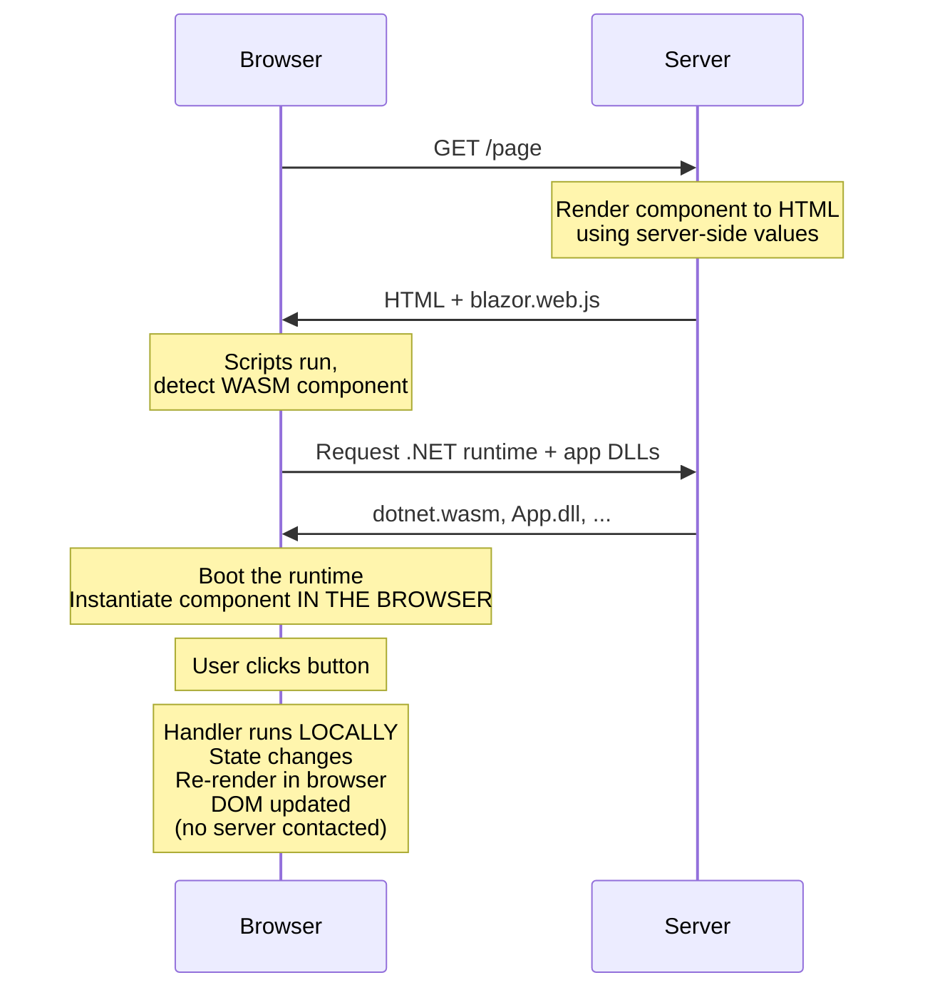
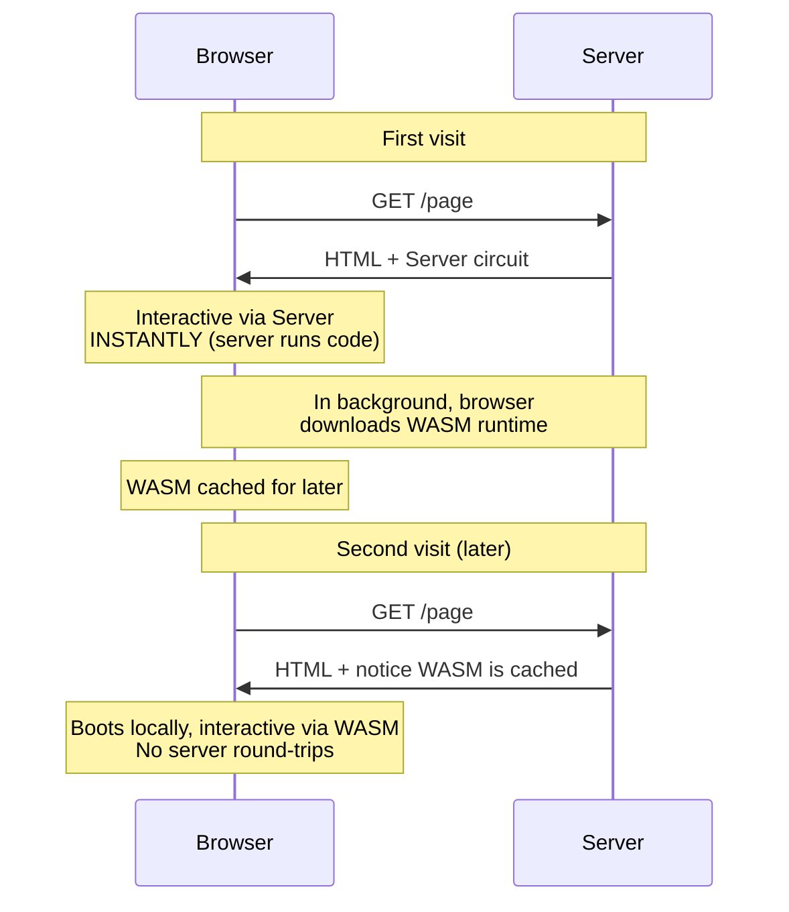
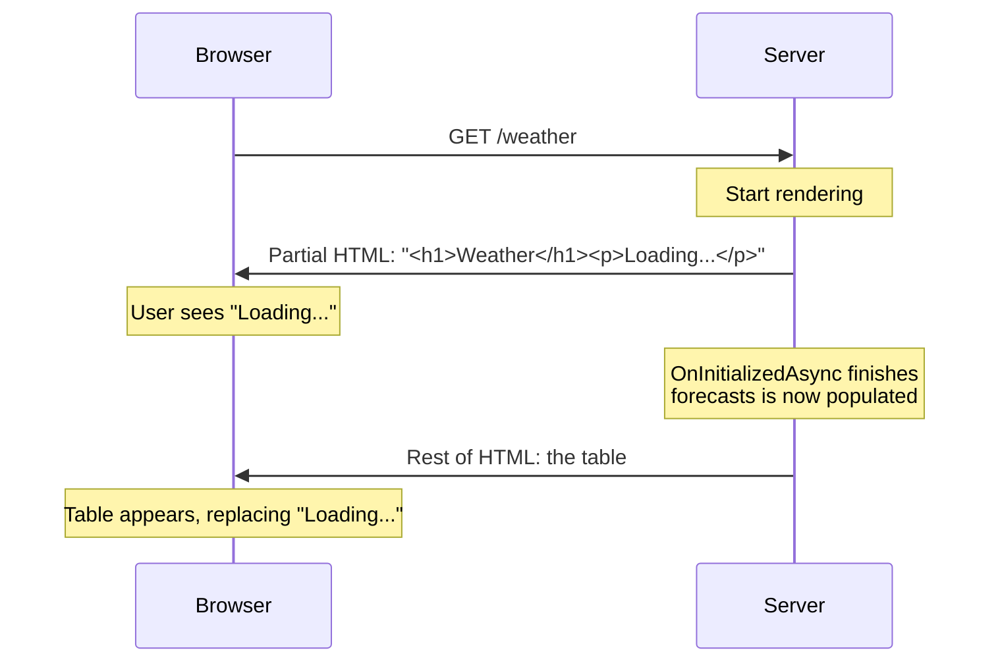

# Lesson 11 — Render Modes and Interactivity

> **Recap:** You know what components are, how routing works, and you've seen `@rendermode InteractiveServer` several times without really understanding it.
>
> **This lesson:** Render modes are the key to how modern Blazor (.NET 8+) mixes static and interactive content. This is where a lot of beginners get stuck — so we're going slow.

---

## The Problem Render Modes Solve

In the old Blazor world (pre-.NET 8), you had to make one architectural choice for the whole project:

- "Entire app is Blazor Server," or
- "Entire app is Blazor WebAssembly"

Every component had to use the same model. That was wasteful:
- A marketing landing page doesn't need any interactivity — rendering it on the server as static HTML would be fastest
- A simple form might benefit from being interactive on the server (small payload)
- A rich data-viz chart might benefit from WebAssembly (zero latency)

You couldn't mix them. Pick one, live with it.

**.NET 8 fixed this with render modes.** Now you can choose the render mode **per component** in a single unified project.

---

## The Four Render Modes



Each mode is a trade-off between startup time, interactivity, latency, and hosting cost.

---

## Mode 1: Static Server-Side Rendering (the default)

If a component has no `@rendermode` directive, it runs in **Static SSR mode**.

### What happens



### What works
- Rendering the HTML based on C# state
- `@if`, `@foreach`, `@inject`, expressions — everything except events
- Route parameters
- Dependency injection
- SEO-friendly — search engines see complete HTML

### What does NOT work
- `@onclick`, `@oninput`, any event handlers
- `@bind` (two-way binding)
- Changing state after initial render
- Anything that requires a round trip back to the server

### When to use it
- Landing pages
- Marketing pages
- Documentation pages
- Any page that just **displays** stuff and doesn't need to **react** to user input

### Example

This `Home.razor` has no render mode declared, so it's static:

```razor
@page "/"

<PageTitle>Home</PageTitle>

<h1>Hello, world!</h1>

Welcome to your new app.
```

If you added a `<button @onclick="Click">` to this file, **it would compile, render, and do absolutely nothing when clicked**. That's a common gotcha.

---

## Mode 2: InteractiveServer

This is the one you've been using for the Counter. Declare it with `@rendermode InteractiveServer`.

### What happens



### Characteristics

| Aspect | Value |
|--------|-------|
| **Where code runs** | Server |
| **State location** | Server (in the circuit) |
| **Network chatter** | High — every interaction is a round trip |
| **Latency** | ~10–100 ms per click |
| **Server cost** | High — one circuit per user |
| **Startup time** | Fast |
| **Offline?** | No |
| **Code secrecy** | Safe (server-only) |
| **DB access** | Direct, easy |

### When to use it
- Internal business apps
- Admin panels
- Anything where latency isn't critical and server-side simplicity is valuable
- Prototypes and learning

---

## Mode 3: InteractiveWebAssembly

Declare with `@rendermode InteractiveWebAssembly`.

### What happens



### Characteristics

| Aspect | Value |
|--------|-------|
| **Where code runs** | Browser (WASM sandbox) |
| **State location** | Browser memory |
| **Network chatter** | Zero after load |
| **Latency** | Zero |
| **Server cost** | Low — static hosting after load |
| **Startup time** | Slow (multi-MB download) |
| **Offline?** | Yes (if using a PWA manifest) |
| **Code secrecy** | Low — all code ships to the client |
| **DB access** | No direct access; must call an API |

### When to use it
- Apps with rich client-side interactions (data grids, charts, editors)
- Apps that might be used offline
- Apps where you want to minimize per-user server load
- Apps where zero-latency feels matter

### Important: You need a project that supports WASM

If you created your project with `--interactivity Server` (like we did), Blazor is only configured for Server-side interactivity. Trying to use `@rendermode InteractiveWebAssembly` would fail because the necessary services aren't registered.

To enable both, create the project with `--interactivity Auto`, or manually add WebAssembly services to `Program.cs`. We won't do that in this tutorial, but here's what it would look like:

```csharp
// Phase 1
builder.Services.AddRazorComponents()
    .AddInteractiveServerComponents()
    .AddInteractiveWebAssemblyComponents();

// Phase 2
app.MapRazorComponents<App>()
    .AddInteractiveServerRenderMode()
    .AddInteractiveWebAssemblyRenderMode();
```

And you'd need a companion `.Client` project that holds the WASM-runnable components.

---

## Mode 4: InteractiveAuto

Declare with `@rendermode InteractiveAuto`.

This is the clever one: **start as Blazor Server, and the first time the component is used, the browser starts downloading the WASM runtime in the background. On subsequent visits, the WASM is already cached and the component runs in the browser.**

### Visually



### Why this is clever

New users get the speed of Blazor Server (fast first load). Return users get the speed of WebAssembly (zero-latency, no server cost).

### When to use it
- Public-facing apps where first-time users matter but returning users are the bulk of traffic
- Apps that want the best of both worlds

---

## Comparison Table

| Mode | Initial Load | First Click Latency | Return Visit | Server Cost | Offline |
|------|--------------|---------------------|--------------|-------------|---------|
| Static | Fastest | N/A (no interactivity) | Fastest | Cheapest | N/A |
| InteractiveServer | Fast | ~50 ms (round trip) | Fast | High (per-user) | No |
| InteractiveWebAssembly | Slow | 0 ms | Medium (cached) | Low | Yes |
| InteractiveAuto | Fast | ~50 ms first, 0 ms later | Fastest | Medium | Yes (after caching) |

---

## How to Set a Render Mode

### Option 1: On a component directly

```razor
@page "/counter"
@rendermode InteractiveServer

@* ... *@
```

This applies the render mode to this component and everything it contains.

### Option 2: On a component usage

If you have a reusable component and want to decide its render mode from its parent, you can set it at the usage site:

```razor
<Counter @rendermode="InteractiveServer" />
```

### Option 3: App-wide in App.razor

You can make the entire app interactive by putting the `@rendermode` on `<Routes />`:

```razor
<body>
    <Routes @rendermode="InteractiveServer" />
    <script src="_framework/blazor.web.js"></script>
</body>
```

Now every page is interactive by default. **This is easier for learning** — you don't have to remember to add `@rendermode` to every page — at the cost of losing some static-rendering performance.

---

## The Big Gotcha: Interactivity Is Per-Component, Not Per-App

In pre-.NET-8 Blazor, once your app was "Blazor Server," all components could use events. Now, **only components (or their descendants) that have `@rendermode InteractiveServer` can use events**.

This is the source of a very common beginner bug:

```razor
@page "/about"

<h1>About</h1>
<button @onclick="HandleClick">Click me</button>

@code {
    private void HandleClick() { /* never runs */ }
}
```

This compiles, shows the button, but the click does nothing. Why? Because there's no `@rendermode` directive, so the component is **static-rendered**. The button is in the HTML, but Blazor never wires up a handler for it.

**The fix:** add `@rendermode InteractiveServer` at the top.

Or: set it app-wide in `App.razor` as described above.

---

## Streaming Rendering: A Different Beast

While we're here, let's mention a related feature: `@attribute [StreamRendering]`.

Take a look at `Weather.razor`:

```razor
@page "/weather"
@attribute [StreamRendering]

<h1>Weather</h1>

@if (forecasts == null)
{
    <p><em>Loading...</em></p>
}
else
{
    <table>...</table>
}
```

`[StreamRendering]` is **not** a render mode. It's a separate feature that applies to static SSR. Here's what it does:



**Without streaming,** the browser waits for the entire page to render (including the 500ms fake delay in Weather.razor) before showing anything.

**With streaming,** the browser gets a fast initial response and the slow parts stream in later.

You can think of `[StreamRendering]` as: "Server, don't hold the page hostage until my `OnInitializedAsync` finishes — send what you have now, then send the rest when you can."

It works with static SSR. Very useful for pages that do slow async work during initialization.

---

## Practical Recipe: Making a Page Interactive

You've got `Components/Pages/Widget.razor` and you want to add a button with `@onclick`:

1. Add `@rendermode InteractiveServer` at the top:
   ```razor
   @page "/widget"
   @rendermode InteractiveServer

   <button @onclick="Go">Go</button>

   @code {
       private void Go() { /* ... */ }
   }
   ```
2. Run the app. Click the button. It works.

That's it. One line.

If you want the whole app interactive by default, add it to `<Routes />` in `App.razor` and forget about it.

---

## Key Terms

| Term | Meaning |
|------|---------|
| **Render mode** | A per-component setting that determines where/how the component runs |
| **Static SSR** | Default mode — server renders once, sends HTML, no interactivity |
| **InteractiveServer** | Server renders, plus SignalR circuit for events (the old "Blazor Server") |
| **InteractiveWebAssembly** | Component downloads and runs in the browser via WASM |
| **InteractiveAuto** | Starts as Server, upgrades to WASM once downloaded |
| **Circuit** | The server-side session for an Interactive Server component |
| **Streaming rendering** | Applies to static SSR — sends initial HTML fast, streams the rest |
| **`[StreamRendering]`** | The attribute that enables streaming rendering |

---

## Try This

### Experiment 1: The silent-failure bug

1. Create `Components/Pages/Broken.razor`:
   ```razor
   @page "/broken"

   <h1>Broken Counter</h1>
   <p>Count: @count</p>
   <button @onclick="Click">+1</button>

   @code {
       private int count = 0;
       private void Click() => count++;
   }
   ```
2. Navigate to `/broken` and click the button. Nothing happens.
3. Add `@rendermode InteractiveServer` at the top.
4. Navigate again. It works.

This is the single most common beginner bug in modern Blazor. Seeing it happen once will save you from days of confusion.

### Experiment 2: App-wide interactivity

1. Edit `Components/App.razor` and change:
   ```razor
   <Routes />
   ```
   to:
   ```razor
   <Routes @rendermode="InteractiveServer" />
   ```
2. Remove `@rendermode InteractiveServer` from `Counter.razor` (and `Broken.razor` if you still have it).
3. Run the app. Counters still work! Because every page now inherits InteractiveServer from the root.

### Experiment 3: Streaming rendering

1. Look at the current `Weather.razor`. Note that it has `@attribute [StreamRendering]`.
2. Navigate to `/weather`. Notice the "Loading..." flashes briefly, then the table appears.
3. Remove `@attribute [StreamRendering]` from the file.
4. Navigate again (with browser DevTools Network tab open to disable cache). Notice: the browser freezes for ~500ms before anything appears — no "Loading..." flash.

Streaming rendering makes slow pages feel faster by committing to HTML that says "this is loading" before the real data is ready.

---

## Ready for Lesson 12?

You now understand render modes, which is probably the single concept that trips up the most new Blazor developers. The final lesson covers the **component lifecycle** — the sequence of methods Blazor calls on your components as they're created, updated, and destroyed.

➡️ **Next: [Lesson 12 — Component Lifecycle](12-component-lifecycle.md)**
