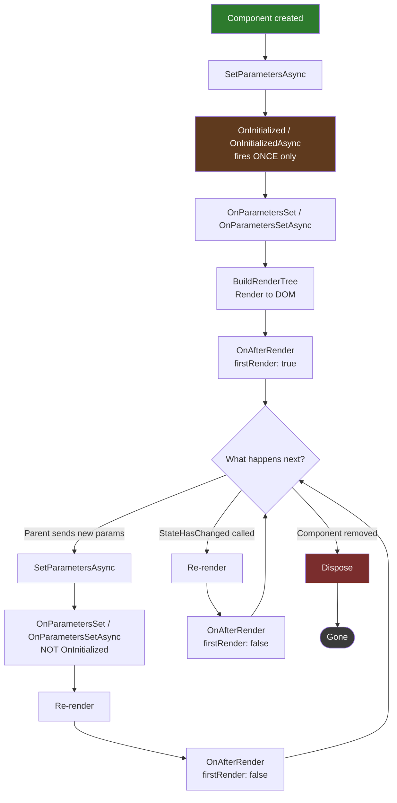
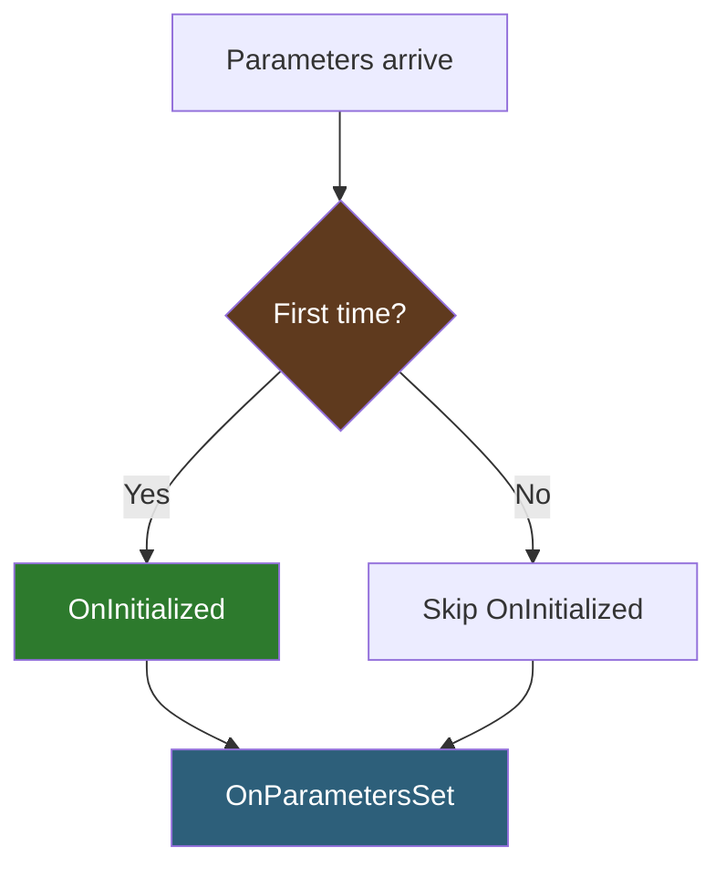
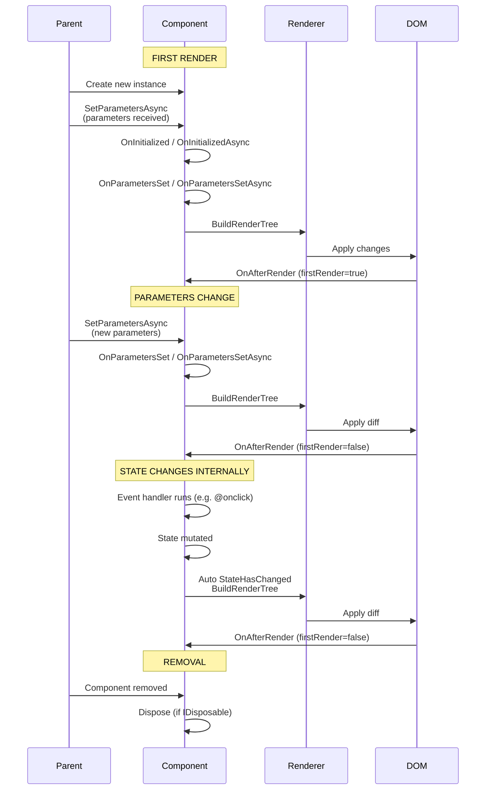

# Lesson 12 — Component Lifecycle

> **Recap:** A component is a C# class that produces HTML. It has state. When state changes, it re-renders. Render modes determine where this happens.
>
> **This lesson:** Every component has a **lifecycle** — a sequence of methods Blazor calls from creation to disposal. Understanding this is key to loading data, reacting to changes, cleaning up resources, and avoiding memory leaks.

---

## Why Lifecycle Methods Matter

You'll constantly need to answer questions like:

- "Where do I load data when the page first appears?"
- "How do I detect when a parent changes my parameters?"
- "How do I run code *after* the DOM is rendered?"
- "How do I clean up a timer when the component goes away?"

Each of these has a lifecycle method designed exactly for it. Blazor gives you hooks — you just need to know which hook to use when.

---

## The Lifecycle Methods

Here are the hooks, in rough order of when they fire:

| Method | When it fires | Common use |
|--------|---------------|------------|
| `SetParametersAsync` | Before any other lifecycle method. Very rarely overridden. | Advanced parameter handling |
| `OnInitialized` / `OnInitializedAsync` | Once, when the component is first created | Load initial data |
| `OnParametersSet` / `OnParametersSetAsync` | After parameters are set (first time AND when parent updates them) | React to parameter changes |
| `BuildRenderTree` | Every time the component is rendered | Auto-generated from Razor — don't touch |
| `OnAfterRender` / `OnAfterRenderAsync` | After the DOM has been updated | JavaScript interop, measuring rendered elements |
| `Dispose` | When the component is removed from the tree | Clean up timers, event subscriptions, etc. |

And a couple more for advanced scenarios:

| Method | When it fires |
|--------|---------------|
| `ShouldRender` | Before re-rendering — return `false` to skip it |
| `StateHasChanged` | You call this manually to trigger a re-render |

---

## The Flow in Pictures

Here's what happens from the moment a component is created to the moment it's disposed:



Key insights from this diagram:
- **`OnInitialized` fires exactly once** — it's for one-time setup
- **`OnParametersSet` fires on every parameter update** (including the first time)
- **`OnAfterRender` fires after every render**, with a `firstRender` flag so you can distinguish the first one
- **`Dispose` fires once** when the component is removed (e.g., the user navigates away)

---

## `OnInitialized` and `OnInitializedAsync`

Fired **once**, after the component is created and its parameters are set for the first time.

### What to do here
- Load initial data from a database or API
- Set up default values
- Subscribe to events (but remember to unsubscribe in `Dispose`)

### Synchronous version

```razor
@code {
    private string greeting = "";

    protected override void OnInitialized()
    {
        greeting = $"Hello, it's {DateTime.Now.Hour} o'clock";
    }
}
```

### Asynchronous version

```razor
@inject HttpClient Http

@code {
    private List<Product>? products;

    protected override async Task OnInitializedAsync()
    {
        products = await Http.GetFromJsonAsync<List<Product>>("api/products");
    }
}
```

Use the async version when you need to `await` something. Blazor will **wait for the task to complete** before rendering — unless you've enabled streaming rendering (see Lesson 11).

### Gotcha

`OnInitialized` fires **once per component instance**. If a user navigates away and comes back, a new instance is created, and `OnInitialized` fires again. But if the same instance stays mounted and only parameters change, `OnInitialized` does NOT fire again — you'd use `OnParametersSet` for that.

---

## `OnParametersSet` and `OnParametersSetAsync`

Fires whenever the parent component sets parameters, including the first time.

### What to do here
- React to parameter changes (e.g., reload data when the URL changes)
- Derive computed values from parameters
- Validate parameters

### Example: reloading data when a route parameter changes

```razor
@page "/product/{Id:int}"
@inject HttpClient Http

<h1>Product @Id</h1>
@if (product != null)
{
    <p>@product.Name</p>
}

@code {
    [Parameter] public int Id { get; set; }

    private Product? product;

    protected override async Task OnParametersSetAsync()
    {
        product = await Http.GetFromJsonAsync<Product>($"api/products/{Id}");
    }
}
```

Why not use `OnInitializedAsync` here? **Because the component can stay mounted when the URL changes.** If the user navigates from `/product/1` to `/product/2`, Blazor keeps the same component instance and just updates the `Id` parameter — `OnInitialized` wouldn't fire again, but `OnParametersSet` would.

### Order of firing



Both fire the first time. Only `OnParametersSet` fires on subsequent updates.

---

## `OnAfterRender` and `OnAfterRenderAsync`

Fires **after** the DOM has been updated. This is the only lifecycle method that runs when you can interact with the rendered DOM.

### Signature

```csharp
protected override void OnAfterRender(bool firstRender) { }
protected override async Task OnAfterRenderAsync(bool firstRender) { }
```

The `firstRender` parameter tells you whether this is the first render (true) or a subsequent one (false).

### What to do here
- JavaScript interop (measuring an element, triggering a JS library)
- Focusing an element
- Initializing third-party libraries
- Logging render times

### What NOT to do here
- **Don't change state** (unless you really know what you're doing) — it will trigger another render, potentially causing infinite loops
- **Don't do heavy synchronous work** — blocks the UI

### Example: focus an input on first render

```razor
@rendermode InteractiveServer
@inject IJSRuntime JS

<input @ref="nameInput" placeholder="Your name" />

@code {
    private ElementReference nameInput;

    protected override async Task OnAfterRenderAsync(bool firstRender)
    {
        if (firstRender)
        {
            await JS.InvokeVoidAsync("HTMLElement.prototype.focus.call", nameInput);
        }
    }
}
```

The `firstRender` check is critical — otherwise you'd re-focus the input every time the component re-renders, which would be annoying.

---

## `Dispose`: Cleaning Up

When a component is removed from the tree (because the user navigated away, or the parent stopped rendering it), Blazor calls `Dispose()` if the component implements `IDisposable`.

### Example: cleaning up a timer

```razor
@implements IDisposable
@rendermode InteractiveServer

<p>Seconds elapsed: @secondsElapsed</p>

@code {
    private int secondsElapsed = 0;
    private System.Timers.Timer? timer;

    protected override void OnInitialized()
    {
        timer = new System.Timers.Timer(1000);
        timer.Elapsed += OnTick;
        timer.Start();
    }

    private void OnTick(object? sender, System.Timers.ElapsedEventArgs e)
    {
        secondsElapsed++;
        InvokeAsync(StateHasChanged);  // MUST marshal back to the UI thread
    }

    public void Dispose()
    {
        timer?.Dispose();
    }
}
```

Notice three things:
1. `@implements IDisposable` declares the class implements the interface
2. `Dispose()` is implemented to stop the timer
3. Inside the timer callback, we call `InvokeAsync(StateHasChanged)` — because the timer runs on a background thread and we need to marshal back to Blazor's UI thread before touching component state

### What happens if you forget `Dispose`?

Memory leak. The timer keeps firing forever, holding a reference to the component, keeping it alive. On a busy server with many users, this adds up fast.

**Rule of thumb:** if you subscribe to an event or start a timer in `OnInitialized`, you must unsubscribe/stop it in `Dispose`.

---

## `StateHasChanged`: The Manual Re-Render Button

Blazor automatically re-renders after every event handler. But if something **outside** the event system changes state, you need to tell Blazor yourself.

### When you need to call it

- A timer fires and updates a field
- An event from a service fires
- An async `Task` completes outside a lifecycle method
- A cascading value changes in a way Blazor can't detect

### When you do NOT need to call it

- Inside `@onclick` and other event handlers — automatic
- Inside `OnInitializedAsync` / `OnParametersSetAsync` — automatic
- After calling a bound property's setter — automatic (with `@bind`)

### Thread safety

If you're calling `StateHasChanged` from a non-UI thread (like a background timer), wrap it in `InvokeAsync`:

```csharp
InvokeAsync(StateHasChanged);
```

This marshals the call back to Blazor's synchronization context, avoiding weird thread-safety issues.

---

## `ShouldRender`: The Optimization Hook

Blazor re-renders eagerly by default. If performance becomes an issue, you can override `ShouldRender` to skip unnecessary re-renders:

```csharp
protected override bool ShouldRender()
{
    return hasRealChanges;
}
```

This is an **advanced optimization**. Don't use it until you have a measured performance problem — it can lead to bugs where the UI doesn't update when it should.

---

## A Complete Lifecycle Example

Here's a component that exercises most of the lifecycle:

```razor
@page "/lifecycle-demo"
@rendermode InteractiveServer
@implements IDisposable

<h1>Lifecycle Demo</h1>
<p>Render count: @renderCount</p>
<p>Timer ticks: @timerTicks</p>

<button @onclick="ForceRerender">Force re-render</button>

@code {
    private int renderCount = 0;
    private int timerTicks = 0;
    private System.Timers.Timer? timer;

    protected override void OnInitialized()
    {
        Console.WriteLine("OnInitialized");
        timer = new System.Timers.Timer(2000);
        timer.Elapsed += OnTimerTick;
        timer.Start();
    }

    protected override void OnParametersSet()
    {
        Console.WriteLine("OnParametersSet");
    }

    protected override void OnAfterRender(bool firstRender)
    {
        renderCount++;
        Console.WriteLine($"OnAfterRender (firstRender = {firstRender})");
    }

    private void OnTimerTick(object? sender, System.Timers.ElapsedEventArgs e)
    {
        timerTicks++;
        InvokeAsync(StateHasChanged);
    }

    private void ForceRerender()
    {
        Console.WriteLine("Click handler fired — Blazor will auto-re-render");
    }

    public void Dispose()
    {
        Console.WriteLine("Dispose");
        timer?.Dispose();
    }
}
```

Watch your console as you navigate to and from this page and click the button. You'll see:

1. When the page loads: `OnInitialized`, `OnParametersSet`, `OnAfterRender (firstRender = true)`
2. Every 2 seconds: `OnAfterRender (firstRender = false)` (from the timer triggering a re-render)
3. When you click the button: the click handler logs, then another `OnAfterRender`
4. When you navigate away: `Dispose`

**Watching a component's lifecycle in action is the best way to internalize it.** Copy this file into your project and play with it.

---

## Lifecycle Timing: A Deeper Look

Here's a more detailed sequence diagram showing the exact order for the first render, a parameter change, and disposal:



---

## Common Patterns

### Pattern 1: "Load data when the page first appears"
```csharp
protected override async Task OnInitializedAsync()
{
    data = await service.GetDataAsync();
}
```

### Pattern 2: "Reload data when the URL parameter changes"
```csharp
[Parameter] public int Id { get; set; }

protected override async Task OnParametersSetAsync()
{
    data = await service.GetByIdAsync(Id);
}
```

### Pattern 3: "Run a JS library on the rendered element"
```csharp
protected override async Task OnAfterRenderAsync(bool firstRender)
{
    if (firstRender)
    {
        await JS.InvokeVoidAsync("initChart", chartDiv);
    }
}
```

### Pattern 4: "Clean up a background subscription"
```csharp
@implements IDisposable

protected override void OnInitialized()
{
    service.OnDataChanged += HandleChange;
}

public void Dispose()
{
    service.OnDataChanged -= HandleChange;
}
```

---

## Key Terms

| Term | Meaning |
|------|---------|
| **Lifecycle** | The sequence of methods Blazor calls on a component from creation to disposal |
| **`OnInitialized` / `OnInitializedAsync`** | Fires once after the component is created. For one-time setup. |
| **`OnParametersSet` / `OnParametersSetAsync`** | Fires every time parameters are set, including the first. For reacting to parameter changes. |
| **`OnAfterRender` / `OnAfterRenderAsync`** | Fires after the DOM has been updated. For JS interop and DOM measurement. |
| **`firstRender`** | Parameter to `OnAfterRender` — true on the initial render only |
| **`Dispose`** | Called when the component is removed. For cleanup. Requires `@implements IDisposable`. |
| **`StateHasChanged`** | Method you call to manually trigger a re-render |
| **`InvokeAsync(StateHasChanged)`** | Thread-safe version — use when calling from non-UI threads |
| **`ShouldRender`** | Optional override to skip unnecessary re-renders (advanced) |

---

## Try This

Create `Components/Pages/LifecycleDemo.razor` with the complete example above. Run the app, open the Visual Studio / `dotnet run` console window, and navigate to `/lifecycle-demo`. Watch the messages flow in the console as you:

1. First load the page
2. Click the button
3. Wait 4 seconds (see two timer ticks)
4. Navigate to a different page

You should see the entire lifecycle play out in real time. **This is the single exercise that will make the lifecycle "click" for you.**

---

## You Made It

Congratulations — you've reached the end of the foundations.

At this point, you have enough mental framework to:

- **Read any Blazor project** and understand its structure
- **Add new pages** with their own routes, layouts, and components
- **Pass data** between parents and children
- **Handle events** correctly, with the right render mode
- **Load data** at the right lifecycle point
- **Clean up** resources without leaking memory
- **Debug** the most common beginner issue (the silent `@onclick` that does nothing)

### What to learn next

These are the logical next topics, in roughly increasing order of difficulty:

1. **Forms and validation** (`EditForm`, `InputText`, `DataAnnotationsValidator`)
2. **Event callbacks** (passing events from child to parent)
3. **Cascading values and parameters** (sharing data through the component tree)
4. **Dependency injection** in depth (scoped vs singleton vs transient)
5. **JavaScript interop** (`IJSRuntime`, calling JS from C# and vice versa)
6. **Authentication and authorization** (`AuthorizeView`, `AuthenticationStateProvider`)
7. **Building a real app** — pick something small but not trivial, and ship it

### Resources

- Official Microsoft Blazor docs: `https://learn.microsoft.com/aspnet/core/blazor/`
- The ASP.NET Core samples on GitHub
- The Blazor University site for deep dives
- The `dotnet/aspnetcore` GitHub repo if you want to read how it's actually built

---

### Thank you

This was a long tutorial. If you read it all, you now have a solid mental model that will carry you through building real Blazor applications. Everything from here on is details, not fundamentals.

➡️ **Back to [README](../README.md)**
